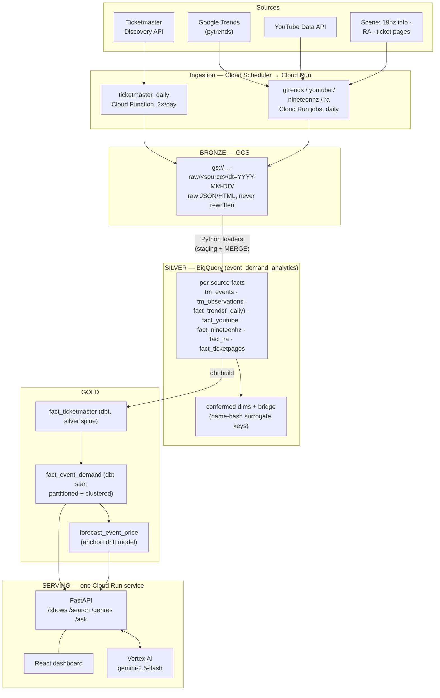
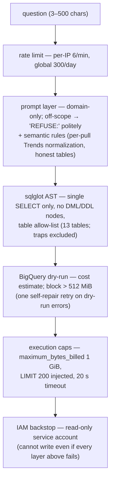

# System architecture & design decisions

The consolidated map of **how the system is designed, what it's built on, and why**.
Each section states the decision and the implementation pattern, then points at the
one place the full detail lives — this doc is the front door, not a duplicate.

Companion docs: [`data-model.md`](data-model.md) (the schema itself) ·
[`transformations_showcase.md`](transformations_showcase.md) (every transform with
sample I/O + SQL) · [`REPO_STATE.md`](REPO_STATE.md) (live status, freshness,
incidents) · [`lakehouse-plan.md`](lakehouse-plan.md) (task board + Q&A prep) ·
[`product-decisions.md`](product-decisions.md) (what users see: ordering, popularity, synth stance, QA layers).
A topic-by-topic index is at the [bottom of this doc](#detail-map--where-every-implementation-detail-lives).

## 1. The system in one view

Six sources land raw in GCS bronze; Python loaders conform them into per-source
silver facts + shared dimensions in BigQuery; dbt assembles the gold star; a
precomputed forecast and a single Cloud Run service (dashboard + guardrailed
text-to-SQL agent) serve it. One nightly job refreshes the whole analytical state
in a single fail-fast execution so the layers never drift apart.

Around the data path: **Terraform** (two roots) provisions the infra, **Cloud
Monitoring** alerts on any failed job, **GitHub Actions CI** runs ruff + pytest +
`terraform validate` (both roots) + the web test/build on every push, and a
separate BigQuery dataset **`event_demand_synth`** holds the synthetic sandbox and
benchmark tables — never mixed into the honest tables.

## 2. Design principles

1. **Medallion with honesty rules.** Bronze is immutable raw truth; silver is
   *observed-only* (no forward-fill — `tm_observations` records a price only on the
   day it was actually seen); any gap-filling lives in explicitly labeled gold
   tables (`fact_event_demand_continuous`, every filled row flagged
   `price_is_filled`). Consumers can always tell measurement from interpolation.
2. **Deterministic and idempotent everywhere.** Every silver loader is staging
   `WRITE_TRUNCATE` + atomic `MERGE`; dbt models are incremental `merge`; the
   forecast is `WRITE_TRUNCATE` + fixed seed; the synth generator is seeded per
   event. Any step can be re-run and converges to the same state — backfills and
   retries are safe by construction. No LLM runs inside the pipeline.
3. **Schema as guardrail.** The text-to-SQL agent's table allow-list *excludes*
   `tm_events` (carries prices forward — a forward-fill trap) and
   `fact_event_demand_continuous` (team-derived fill would poison coverage
   answers). The schema design itself constrains what the agent can get wrong.
4. **Right-size the compute.** ~46 GiB of bronze JSON and ~1M-row facts need
   BigQuery for the SQL and one-vCPU Cloud Run for the glue — not a Spark cluster.
   Every component is serverless and scales to zero.
5. **Everything is code, committed.** Infra in Terraform, transforms in dbt +
   versioned Python, analysis/QC in re-runnable `eda/` scripts with committed
   outputs, decisions in decision-record docs. Nothing load-bearing lives in a
   notebook or a console click (known exception: the demo service is
   gcloud-deployed, see [§9](#9-known-gaps--future-work)).

## 3. Tech-stack decisions (what, why, what we rejected)

| Layer | Choice | Why | Rejected alternative |
|---|---|---|---|
| Raw storage | **GCS**, `dt=`-partitioned JSON/HTML | cheap immutable landing zone; replayable into silver forever | landing straight into BQ (loses raw fidelity, can't re-parse) |
| Warehouse | **BigQuery** | serverless OLAP, per-query billing, native partitioning/clustering (our benchmark), IAM-integrated read-only agent access | Postgres (row-store, we're analytical) · DuckDB (no shared cloud state) |
| Bronze→silver | **Python loaders** (`pipeline/silver/`) | parses raw JSON/HTML with per-source quirks (pytrends payloads, JSON-LD) that SQL/dbt can't express | dbt external tables over raw JSON (fragile, no per-source logic) |
| Silver→gold | **dbt** (incremental star + tests + lineage) | where dbt pays off: star assembly, data tests, docs; class requirement met where it matters | full dbt migration of silver too (MIG-1/2/3 — real, not urgent) |
| Compute | **Cloud Run** (function + jobs), 1 vCPU | jobs finish in minutes; Spark adds cluster cost/ops for zero benefit under ~100 GB working sets | Dataproc/Spark (overkill) · Databricks (new platform + cost, no gain at this scale) |
| Orchestration | **Cloud Scheduler → one fail-fast job** (`gold-refresh`, 8 sequential steps) | the DAG is a straight line run once a day; a sequential script with fail-fast + idempotent steps is the whole requirement | Airflow/Cloud Composer (~$300+/mo standing infra to express a linear cron) |
| Forecast | **anchor + drift** (last real price + tier drift) | 96% of shows never move price — anchoring cut premium-tier MAE $98→$5 | ML-heavy models (no signal to learn at that base rate) |
| LLM | **Gemini 2.5 Flash via Vertex AI** (`location=global`, temp 0, seed 683, thinking off) | same GCP project/billing (education credits), no new API key, ~$0.003/question; text-to-SQL over a 12-table schema is well within Flash | Claude/OpenAI (quality we don't need + external billing/keys) · Gemini Pro (5–10× cost/latency; kept as env fallback) |
| Serving | **one Cloud Run service**: FastAPI + built React as static files | same-origin (no CORS), one deploy, one URL, scale-to-zero | separate frontend hosting (CORS + 2 deploys for a demo) |
| Validation | **Great Expectations** gates in the nightly job + offline **pytest** (253+, network faked) | GX validates the *data* each run and fails the run; pytest validates the *code* in CI | — |
| IaC | **Terraform, two roots** (`terraform/` local state · `terraform/gtrends/` remote GCS state) | remote-state root lets any teammate apply Trends/YouTube/scene infra without sharing the maintainer's state or the TM key | one root (couples teammate work to one laptop's state) |

The per-decision defense (one paragraph each, for Q&A) is maintained in
[`lakehouse-plan.md` §"Why we can defend each choice"](lakehouse-plan.md).

## 4. Ingestion — collectors and deliberate throttling

| Collector | Runtime | Cadence | Key constraint encoded |
|---|---|---|---|
| `cloud_functions/ticketmaster_daily/` | Cloud Function | 2×/day (05:00 + 15:00 PT) | pricing coverage (~23%) is a **source ceiling** — events are priced from first observation or never, so re-polling unpriced events is wasted quota (measured: `docs/collection_efficiency_review.md`) |
| `google_trends_api/` | Cloud Run jobs (daily + backfill) | daily, 6h window | **one artist + one geo per request** (the 0–100 scale is per-pull — batching keywords silently rescales everything); single stream, ≥20 s between calls, 800-call/day budget counted from bronze files |
| `youtube_api/` | Cloud Run job | daily | no geography, no history upstream → forward snapshots only (subscribers + topic views) |
| `nineteenhz_api/` (+ ticket-page JSON-LD poller) | Cloud Run job | daily 08:00 PT | ~75% of club listings carry face prices — the pricing signal TM structurally lacks |
| `ra_api/` | Cloud Run job | daily 08:15 PT | **1 request/day by written agreement** ([`ra_access_request.md`](ra_access_request.md)) — never manual-run on a scheduled day |

Every collector writes raw responses untouched to
`gs://data-architecture-498123-raw/<source>/dt=YYYY-MM-DD/` via `common/gcs_io.py`.
Cadence rationale (D1–D8): [`collection_efficiency_review.md`](collection_efficiency_review.md).

## 5. Silver + gold — the transform layer

**The silver idempotency pattern** (every loader in `pipeline/silver/`): read a
bounded bronze window → build a dataframe → load to a staging table with
`WRITE_TRUNCATE` → one atomic `MERGE` into the target on the natural key. Re-runs
and overlapping backfills converge; a failed run leaves the target untouched.

**Identity is name-hash keyed.** `artist_id` = hash of the normalized artist name
(`common/keys.py`), so Ticketmaster and Trends rows join without a shared upstream
id — which makes *identical name normalization on both sides* a hard contract.
Trends geo codes (`US-CA-807`) are stripped to bare DMA (`807`) for venue joins.
Details: [`data-model.md` §8](data-model.md).

**Gold is a dbt star on a Ticketmaster spine.** `fact_ticketmaster` (dbt, silver)
is the price spine; `fact_event_demand` LEFT-JOINs the other signals onto the
**headliner** artist + venue DMA at `(event_id, snapshot_date)` grain — every
spine row survives (a singular dbt test asserts gold rows == spine rows). All
three dbt models are `snapshot_date`-partitioned and `event_id`-clustered —
measured to cut single-day scans **−96%** and event-history scans **−79%**
([§8](#8-performance--scale-measured)). The incremental build reprocesses a
trailing window (not just new dates) because the daily Trends series lands up to
~4 days late. Stage-by-stage walkthrough with SQL:
[`transformations_showcase.md`](transformations_showcase.md).

**The forecast is precomputed, not on-demand.** `model/` fits anchor+drift and
`WRITE_TRUNCATE`s `forecast_event_price` nightly (fixed seed). Decision record
with evidence and rollback: [`forecast_model_decision.md`](forecast_model_decision.md).

**Orchestration**: the `gold-refresh` Cloud Run job (16:30 PT daily, after the
15:00 PT TM sweep) runs silver loaders → dbt build → forecast export → a Great
Expectations gate, sequentially with fail-fast — so a partial refresh never
silently ships and all signals land in one consistent snapshot. Full runbook:
[`pipeline/GOLD_REFRESH.md`](../pipeline/GOLD_REFRESH.md).

## 6. Serving — dashboard, search, and the text-to-SQL agent

One Cloud Run service (`event-demand-api`) serves the FastAPI API and the built
React app as static files (same origin, no CORS). The service's service account
is **read-only by design**: `bigquery.jobUser` + dataset `dataViewer` +
`aiplatform.user` — it physically cannot write to the warehouse, which is the
final guardrail backstop for the agent.

- **Dashboard** — hero-show dropdown (pre-cached in `web/src/data/heroShows.ts`,
  regenerated by `eda/hero_candidates.py`), per-show chart combining price
  history, Trends, YouTube, and the forecast.
- **Search** — `GET /search` (genre / artist / geo / max price / horizon) over the
  gold star; `GET /genres` feeds the dropdown; result rows click through to the
  full combined-signal view, and the price chart has a default-on "fill price
  gaps" toggle (carried-forward points visibly distinct — never called
  synthetic).
- **"How it works"** — a public docs view rendering the repo's committed
  markdown (this file, the data model, REPO_STATE…), bundled into the image at
  build time so the page can never drift from the deployed system.
- **Agent** — `POST /ask`: natural-language question → Gemini 2.5 Flash generates
  SQL against a committed schema context → guardrail pipeline → BigQuery →
  summarized answer. Always returns HTTP 200 with
  `status: ok | refused | blocked | rate_limited | error` plus the generated SQL,
  per-layer guardrail verdicts, rows (≤50), bytes scanned, and latency.

**The guardrail stack** (each layer fails safe independently; implementation in
`api/text2sql.py`):

The LLM client pins `temperature=0`, `seed=683`, and — the Gemini 2.5 gotcha —
`thinking_budget=0` (otherwise the model burns its output budget on thinking and
returns empty text). The schema context (`api/schema_context.md`) is **generated,
validated, and committed** by `eda/build_schema_context.py`: live
`INFORMATION_SCHEMA` + curated semantic notes, **canonical value vocabularies**
(genres, statuses, top metros — added after live users hit invented-literal
answers), and few-shot examples that are dry-run-validated at generation time.
Robustness earned from real usage: **multi-turn follow-ups** (≤3 prior turns in
the prompt), a **zero-row corrective retry** behind the full guardrail chain,
NULL-safe metric rankings, and — since 2026-08-10 — **`fact_nineteenhz` on the
allow-list**, so Bay Area club-show questions reach the silver scene source the
star doesn't cover. Answers that list shows carry `event_id`, which the UI turns
into dashboard click-throughs; 👍/👎 votes stream to the separate
`event_demand_ops` dataset for offline curation. Quality is measured, not vibed:
`eda/eval_text_to_sql.py` scores 32 questions × 3 runs by **execution-result
match** against gold SQL — currently **97%** over 96 runs (trajectory
76→92→95→97 as documented failure modes were fixed), with the taxonomy in
[`eda/output/text_to_sql_eval.md`](../eda/output/text_to_sql_eval.md) and real
user questions logged (with root causes) in `eda/user_test_log.yaml`.

## 7. Synthetic sandbox (`event_demand_synth`)

A separate BigQuery dataset — never rows in the honest tables — serving three
purposes: richer agent demos (an opt-in `dataset: synth` toggle with a disjoint
table allow-list and a visible SYNTHETIC label), gap illustration (TM bronze has
**0.0%** resale price data — measured), and benchmark scale.

Hybrid design: the **real** event spine + **researched** venue capacities
(`reference/venue_capacities.csv`, 197 sourced with URLs — real because it's
knowable) + **synthetic-only** sellout/resale dynamics from seeded heuristics
(`synth/heuristics.py`) that encode observed market behavior: demand pressure =
f(local Trends interest, global YouTube reach, capacity) → sellout probability/
timing → resale multiplier (oversubscribed small rooms resell above face,
undersold big rooms below, festival day tickets anchor to the sum of headliners'
solo prices). Per-event seeded RNG makes output order-independent and
byte-identical across runs; every table carries `synth_run_id`,
`generator_version`, and per-column `*_source` provenance. QC report (monotonic
demand bands, anecdote regimes): [`eda/output/synth_review.md`](../eda/output/synth_review.md).

## 8. Performance & scale (measured)

Working set: ~46 GiB bronze · gold star ~1.1 M rows (~80 MiB) · 53,861 events /
13,071 artists / 3,875 venues in dims · 13,956 upcoming shows serving forecasts.
Two committed benchmarks (scripts in `eda/`, reports in `eda/output/`):

| Benchmark | Before | After |
|---|---|---|
| **`trends_silver` bounded read window** (the fix that ended the July outage) | full-bronze re-read: 52→59 min, growing daily, then **27 consecutive nightly 3600 s timeouts**; 5,049 objects / 102.7 MiB listed+read | 14-day window: **33.1 min**; 1,275 objects / 25.9 MiB |
| **Partitioning + clustering** (50× scale twins, 54.8 M rows / 3.98 GiB each, re-run 2026-08-09 on fresh gold) | flat table: single-day 803 MiB; event history 2,877 MiB; 14-day window 987 MiB | partitioned+clustered: **16.2 MiB (−98%)**; **630 MiB (−78%)**; **234 MiB (−76%)** — cluster pruning only visible in *actual* bytes, dry-run can't see it |

Serving cold start: **~30 s** (was 152 s — the pre-warm ran through BigQuery's
paginated REST path until a failed deploy exposed it; fixed with the Storage
API + a non-blocking startup thread). Post-deploy QA: `eda/qa_smoke.py` runs 14
deterministic live checks (endpoints, guardrails, the answer-row click-path
contract) after every deploy. Cost: storage pennies/month, BigQuery within free
tier, agent ≈ $0.003/question — details in the root README's cost section.

## 9. Known gaps & future work

- **Silver is Python, not dbt** (MIG-1/2/3) — deliberate; see §3. Migrating would
  collapse gold-refresh steps 1–5 into one `dbt build`.
- **`trends_silver` at 33 min is still serial** — ~1,275 per-file `gsutil cat`
  reads at ~1.5 s each; batching/parallel reads are the next optimization.
- **`forecast_event_price` has no date column** — you can't tell from the table
  when it was computed (observability hole; noted in `data-model.md` §8).
- **Scene facts aren't in gold yet** — collected and conformed, not star-joined
  (needs cross-source event identity: venue+date+title matching). Interim
  (2026-08-10): the agent reads `fact_nineteenhz` directly from silver for
  club-show questions, clearly attributed, rows unlinked.
- **The demo service is gcloud-deployed, not Terraform** — the one infra piece
  outside IaC.
- **`api/gold.py` loads the whole gold star on startup** (`SELECT *` into memory)
  — fine at ~80 MiB, the first thing to fix at 10× scale.

## Detail map — where every implementation detail lives

| Topic | Design / decision doc | Implementation |
|---|---|---|
| Schema (every table + column, keys, ER diagrams) | [`data-model.md`](data-model.md) | `dbt/models/`, `pipeline/silver/` |
| Every transform, stage by stage, with sample I/O + SQL | [`transformations_showcase.md`](transformations_showcase.md) | same |
| Nightly orchestration (steps, fail-fast, schedule, backfill) | [`pipeline/GOLD_REFRESH.md`](../pipeline/GOLD_REFRESH.md) | `pipeline/gold_refresh.py`, `terraform/gold_refresh_job.tf` |
| Collection strategy & cadences (findings 1–12, decisions D1–D8) | [`collection_efficiency_review.md`](collection_efficiency_review.md) | collector dirs + their READMEs |
| Forecast model (evidence, decision, rollback) | [`forecast_model_decision.md`](forecast_model_decision.md) | `model/` |
| Text-to-SQL agent (guardrails, prompts, seam) | this doc §6 + docstring in `api/text2sql.py` | `api/text2sql.py`, `api/schema_context*.md`, `eda/build_schema_context.py` |
| Agent quality (accuracy by tier, failure taxonomy) | [`eda/output/text_to_sql_eval.md`](../eda/output/text_to_sql_eval.md) | `eda/eval_text_to_sql.py`, `eda/text2sql_eval_set.yaml` |
| Synthetic layer (heuristics, provenance, QC) | [`eda/output/synth_review.md`](../eda/output/synth_review.md) | `synth/`, `reference/` |
| Benchmarks (before/after evidence) | [`eda/output/benchmark_trends_window.md`](../eda/output/benchmark_trends_window.md) · [`benchmark_partitioning.md`](../eda/output/benchmark_partitioning.md) | `eda/benchmark_*.py` |
| Deploy & infra (two roots, remote state, images) | [`terraform/README.md`](../terraform/README.md) · [`terraform/gtrends/README.md`](../terraform/gtrends/README.md) · [`google_trends_api/DEPLOY.md`](../google_trends_api/DEPLOY.md) | `terraform/`, `*/cloudbuild.yaml` |
| Data quality gates | [`great_expectations/README.md`](../great_expectations/README.md) | `great_expectations/` |
| Live status, freshness, incident log (the July outage) | [`REPO_STATE.md`](REPO_STATE.md) | — |
| Task board, locked decisions, Q&A defense per choice | [`lakehouse-plan.md`](lakehouse-plan.md) | — |
| Demo script + fallbacks | [`demo-runbook.md`](demo-runbook.md) | — |
