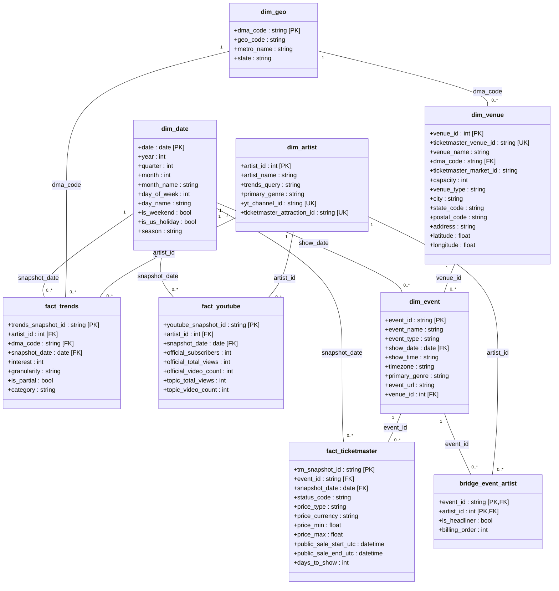
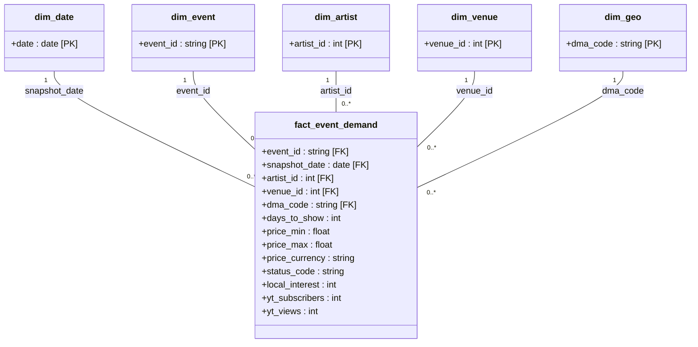

# Data model — UML class diagrams

*Generated by `build_drawio.py` from the ER blocks in `data-model.md`. Do not edit by hand.*

## Silver - source constellation

## Gold - fact_event_demand star

