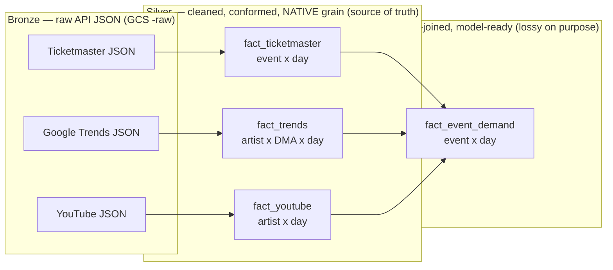
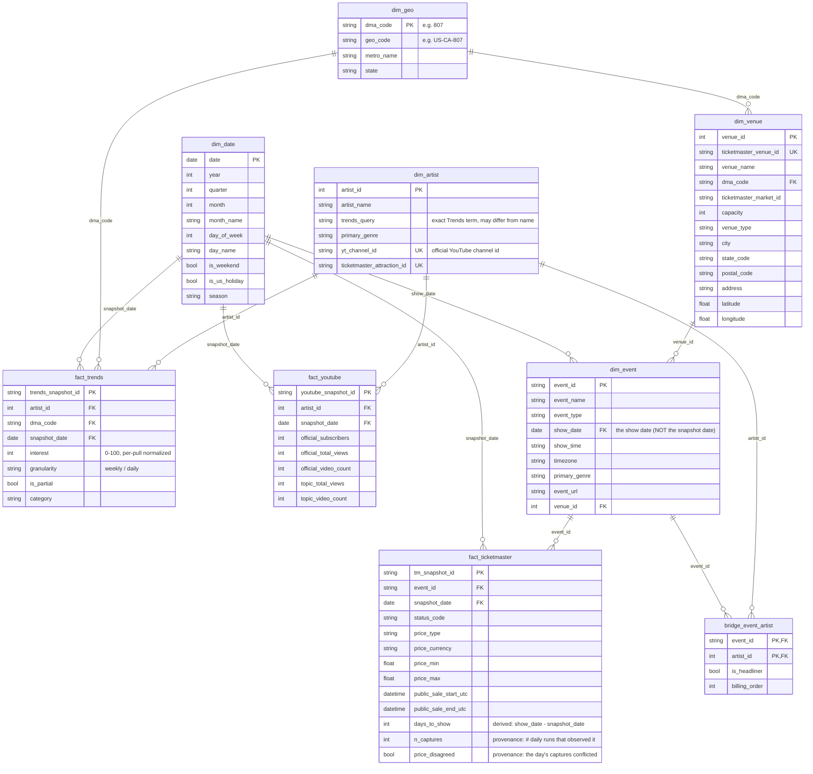
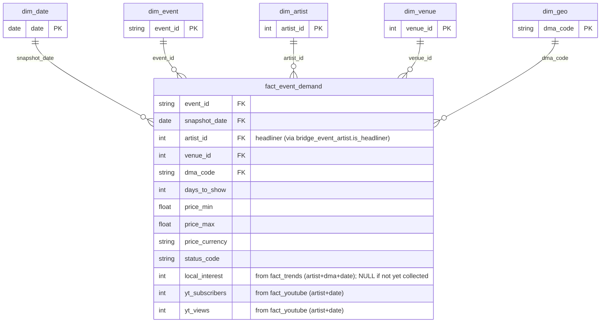

# Data model — silver constellation + gold star

Cleaned-up data model for the event-demand warehouse, derived from the WIP
Lucidchart draft (`docs/shakshuka-domain-and-data-model.png`). It fixes the issues
found in review and presents the schema as **two layers that share one set of
dimensions**.

The diagrams below are **Mermaid** code blocks. They render automatically on
GitHub / in VS Code (Mermaid preview), and you can paste any block straight into
**Lucidchart**.

## View it in Lucidchart

Lucidchart **can't** auto-build an ERD from a raw `.sql` file (that path needs a
live database connection). It **can** import **Mermaid**:

1. Open a Lucidchart document.
2. In the far-left **Primary Toolbar**, click the **Diagram as code** (`</>`) icon.
3. Choose **Mermaid**.
4. Paste one code block below (e.g. the Silver `erDiagram`), then repeat for Gold.

> Lucid limitation: a Mermaid-imported diagram displays as an **image edited through
> the code**, not draggable shapes. That's fine for reviewing/understanding the model;
> if you later want freely draggable boxes you'd redraw them or use Lucid's
> developer JSON Standard Import.

---

## 1. How the layers fit together (bronze → silver → gold)

This is **one model in two consumption layers**, not two separate models. The
**dimensions are conformed** — the *exact same* `dim_*` tables feed both layers.
Only the **fact** tables differ.



- **Bronze** = the raw API JSON exactly as pulled (your Terraform `-raw` bucket).
- **Silver** = each source cleaned and kept at its **native grain**, nothing thrown
  away. This is the queryable **source of truth**. Three facts here that share
  dimensions = a **fact constellation**.
- **Gold** = one wide table (`fact_event_demand`) that pre-joins the sources to one
  grain so the forecasting model / dashboard reads it with minimal joins. It is
  **deliberately lossy**.

**You query both.** Hit **gold** for the common "demand per upcoming event" question.
Drop to **silver** when gold threw away what you need — e.g. *"does rising search
interest in a metro precede rising prices?"* needs the full **artist × DMA × day**
interest curve, which only `fact_trends` (silver) keeps. Gold collapsed Trends to one
number per event/metro/headliner.

---

## 2. Star vs. snowflake — and where this model sits

- **Star** — central fact + each dimension is one **flat** table. One join hop
  (`fact → dim`). Simple, fast, slightly redundant.
- **Snowflake** — a dimension is **normalized into sub-tables** (`dim_artist →
  dim_genre → …`). More joins, less redundancy, more complexity.
- **Fact constellation / galaxy** — several facts sharing **conformed** dimensions
  (what the silver layer is). "Star/snowflake" only describes the *dimension* shape.

**This model = a fact constellation with flat (star) dimensions.** The WIP draft had
one accidental snowflake — a separate `dim_genre` hanging off the artist — which we
**collapsed** into a `primary_genre` column on `dim_artist`:

```
SNOWFLAKE (draft):  dim_artist(..., genre_id FK) ──> dim_genre(genre_id, genre_name)
STAR (here):        dim_artist(..., primary_genre)        ← genre is just a column
```

Why star here: the dimensions are tiny (≈3.2k venues, tens–hundreds of artists, a
handful of genres) and BigQuery dictionary-compresses repeated strings — snowflaking
saves almost no storage and costs an extra join on every genre query. (If an artist
genuinely needs **multiple** genres, that's a true many-to-many → use a
`bridge_artist_genre` table, *not* a snowflake — see §7.)

---

## 3. Silver layer — source constellation

Three source facts, each at its **native grain**, sharing the conformed dimensions.
`PK` = primary key, `FK` = foreign key, `UK` = unique/business key (an alternate id
from the source system — *not* a foreign key).



**Grain (the unique business key behind each surrogate PK):**

| Fact | Grain | Source |
|---|---|---|
| `fact_ticketmaster` | one **event × snapshot_date** | Ticketmaster |
| `fact_trends` | one **artist × dma × snapshot_date** | Google Trends |
| `fact_youtube` | one **artist × snapshot_date** | YouTube |

> ⚠️ **`fact_trends.interest` is per-pull normalized (0–100).** Each value is scaled
> within its own `(artist, geo, timeframe)` series. It is comparable **across time for
> one artist in one metro**, and **never** across artists or across metros. Don't
> average it across artists/DMAs without re-normalizing.

> **Two different dates:** `dim_event.show_date` is when the concert happens;
> `fact_*.snapshot_date` is the day we captured the snapshot. `days_to_show` is the
> gap — a key demand feature.

> 🛡️ **`fact_ticketmaster` is honest — no forward-fill.** A row exists **only for days
> the daily sweep actually observed the event**, with the price **as observed** (NULL if
> observed unpriced). It is built from `tm_observations` (a silver table the
> `pipeline/silver/tm_observations_to_silver.py` backfill + the daily cloud function load
> straight from **raw bronze**), **not** the processed parquet. The parquet was an export
> of current-state `tm_events` (MERGE-upsert, never deletes) which carried each event's
> last-known price **forward** into every later day — manufacturing a daily series the
> sweep never observed (`eda/diagnose_price_gaps.py` proved the artifact: 0 interior /
> 0 trailing gaps). The scheduler runs ~6×/day; those captures collapse to one row per day
> by **union presence + priced-if-any (latest priced)**, with `n_captures` / `price_disagreed`
> recording the provenance. Gap-filling for charts is **never** done here — see the gold
> `fact_event_demand_continuous` note in §4.

---

## 4. Gold layer — `fact_event_demand` (the model-ready star)

One wide row per **upcoming event per daily snapshot**, with the source measures
pre-joined and FKs to the same conformed dimensions.



- **Grain:** one upcoming event per daily snapshot (same grain as `fact_ticketmaster`).
- **The event is the spine.** `local_interest` and the YouTube measures are
  **left-join enrichments** — `NULL` when collection hasn't reached that artist yet,
  **never** a reason to drop the event.
- **Multi-artist events:** the event-grain star uses the **headliner** for the
  artist-level signals. For full lineup analysis, use `bridge_event_artist` + the
  silver facts directly.
- **`fact_event_demand` is honest (observed-only).** It mirrors the non-forward-filled
  `fact_ticketmaster` spine, so the forecast trains on real observations and the
  **no-row-drop** invariant still holds (`tests/assert_gold_rows_eq_spine.sql`).

> 📈 **`fact_event_demand_continuous` — labeled fill for the demo chart (TEAM-DERIVED).**
> A *separate* gold table for drawing a continuous per-show price line. It forward-fills
> each event's **interior** price gaps only (days between its first and last **observed**
> day — never before first / after last seen), carrying the last-known price and flagging
> every carried row **`price_is_filled = true`**. The honest star is untouched; **never**
> train a model or report coverage on this table. Demand signals (`local_interest`,
> `yt_*`) are left observed-only (NULL on filled days) — only the price line is made
> continuous. Contract enforced by `tests/assert_continuous_fill_labeled.sql`.

---

## 5. Conformed dimensions — why the two new ones earn their place

| Dim | Key | Why it exists |
|---|---|---|
| `dim_geo` | `dma_code` | **The join spine.** Trends is reported by DMA; venues resolve to a DMA. This table is what links Trends ↔ events on metro. In the draft `trends_DMA` was an FK pointing at **nothing** (dangling). |
| `dim_date` | `date` | Holds calendar features you **can't** derive from a date alone — `is_us_holiday`, weekend, season — the demand drivers a forecaster uses. Join once instead of rewriting `EXTRACT(...)` in every query. |
| `dim_artist` | `artist_id` | One flat artist dim; genre denormalized on it; YouTube channel id + TM attraction id live here as business keys. |
| `dim_venue` | `venue_id` | Carries `dma_code` (→ `dim_geo`) and `capacity`. |
| `dim_event` | `event_id` | The event descriptor (name, show date, venue, genre). |

---

## 6. What changed from the WIP Lucidchart, and why

| # | WIP draft | Fixed to | Why |
|---|---|---|---|
| 1 | `trends_DMA` FK on venues & trends, **no parent table** | added **`dim_geo`**; both now `dma_code FK → dim_geo` | dangling FK; this is the project's whole `(artist, metro, date)` join |
| 2 | no date table | added **`dim_date`**; facts FK `snapshot_date` | calendar/holiday features for forecasting; conformed time |
| 3 | `dim_genre` snowflaked off the artist (and drawn M:M *with* an FK column) | dropped; **`primary_genre` on `dim_artist`** | tiny dim → star beats snowflake; M:M-plus-FK was contradictory |
| 4 | `dim_event_artists` drawn **1:1**, named like a dimension | **`bridge_event_artist`**, composite PK, event 1:M / artist 1:M | it's a bridge for a real M:M (TM `attraction_ids` is pipe-joined) |
| 5 | `music events` (thin, no prefix) | **`dim_event`** with real attributes (name, show_date, genre…) | it's the event dimension; needed its attributes; show_date ≠ snapshot_date |
| 6 | `fact_ticketmaster` carried `venue_id` (+ double-linked to venue) | dropped `venue_id` | venue is reachable via `dim_event`; redundant |
| 7 | `fact_youtube.youtube_artist_id` (FK) | removed; lives on `dim_artist.yt_channel_id` | channel id is an artist attribute, not a per-snapshot fact column |
| 8 | "FK" on `ticketmaster_venue_id`, etc. | relabeled **UK** (business key) | an FK must point at a parent PK; these don't |
| 9 | `price` typed `unique`; many `Type`/`Field` | real measures: `price_min/max/currency`, `status_code` | price isn't unique; match the actual TM fields |
| 10 | mixed `dim_artists`/`dim_genre`/`music events`/`tickemaster` | snake_case, singular dims, `dim_`/`fact_`/`bridge_`; fixed typo | consistency / readability |

Column names trace to the real collectors: `ticketmaster_api/ticketmaster_poc.py`
(row dict), `google_trends_api/sample_data/bay_area_edm_sample.csv` (header),
`youtube_api/collect_youtube.py` (record).

---

## 7. Open decisions (pick with the team)

- **Genre:** single `primary_genre` on `dim_artist` (assumed here, simplest) **vs.**
  a `bridge_artist_genre(artist_id, genre_id)` if an artist needs multiple genres.
- **Keys:** surrogate `artist_id` / `venue_id` (assumed) **vs.** using the source
  natural ids (TM ids) directly as PKs to skip surrogate generation for the midterm.
- **SCD / history:** dims are treated as current-state. If venue capacity or an
  artist attribute changes and you need history, add SCD-2 columns later.
- **Headliner rule:** how to pick the headliner for the gold row when an event has
  several attractions (TM ordering? first attraction? manual?).
