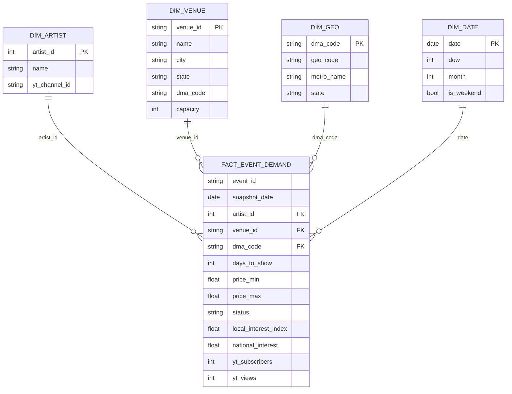

# Schema & processing paradigm — decision doc

*Midterm Design Pitch · MSDS 683. Team-facing. Numbers come from
`analysis/profile_schema.py` (real warehouse, re-runnable) — see
`analysis/output/schema_profile.md`. Last updated 2026-06-15.*

**One-line recommendation:** OLAP, daily batch, **a simple star schema**
(`fact_event_demand` + 4 dimensions) for the audience and the model — fed under
the hood by two small per-source daily fact tables because the sources arrive at
different grains. *Present the star; mention the two helpers in one sentence.*

---

## 1. Processing paradigm — OLAP, daily batch

**OLAP, not OLTP.** There are no transactions to serve — no app writing rows on a
user action. The workload is the opposite: read-heavy analytical aggregation over
snapshots that **accumulate over time** (price/interest/popularity per show as the
date approaches). That's a columnar warehouse (BigQuery) + a star schema, not a
normalized transactional DB.

**Batch, once a day.** Each morning a job processes **yesterday's** raw snapshots
(the `dt=YYYY-MM-DD` partitions the collectors already write) → refreshes the
silver tables → rebuilds the gold star. No streaming: the signals (a show's price,
an artist's search interest) move on a daily cadence, so daily granularity loses
nothing and is far cheaper/simpler. The job is **idempotent** (MERGE/`CREATE OR
REPLACE`), so a re-run is a no-op — re-runnable per our determinism rule.

---

## 2. The one real complication: three sources, three grains

The sources don't share a natural grain, so "just put everything in one fact
table" isn't free — something has to be rolled up:

| Source | Natural grain | What it measures |
|---|---|---|
| Ticketmaster | **event × snapshot-day** | price range, status, days-to-show |
| Google Trends | **artist × DMA(geolocation) × snapshot-day** | local search interest (0–100) |
| YouTube | **artist × snapshot-day** | subscribers, views (global) |

So the decision is really: **force one grain (single star)** or **keep each grain
and join (constellation)?**

---

## 3. Recommendation: star on top, two small helper facts underneath

We keep it **simple to present** — the headline is a textbook star — but honest
about the grains underneath.

### The star we present (grain: one upcoming event, per daily snapshot)

```
                    dim_date
                       │
   dim_artist ──── FACT_EVENT_DEMAND ──── dim_venue
                       │
                    dim_geo (DMA)
```



- **Fact:** `fact_event_demand` — one row per upcoming event per daily snapshot.
  Measures = price, status, days-to-show, local interest, national interest, YT
  popularity. This is what the demand model reads and what we draw on the slide.
  **The event is the spine: every event/artist in the data is included.** Local
  interest and YT popularity are **left-join enrichments** — `NULL` when collection
  hasn't reached that artist yet, never a reason to drop the event.
- **Dimensions (4, conformed):** `dim_artist`, `dim_venue` (carries `dma_code` +
  `capacity`), `dim_geo` (DMA ↔ `US-<ST>-<DMA>` ↔ metro), `dim_date`.

### What feeds it (one sentence on the slide)

> "Because Trends and YouTube come at different grains than events, two small daily
> fact tables sit underneath, and the daily batch rolls them into the star."

```
ticketmaster ─► fact_event_price_snapshot   (event × day)        ┐
google_trends ─► fact_artist_interest_daily  (artist × DMA × day) ├─► fact_event_demand (star)
youtube       ─► fact_artist_popularity_daily(artist × day)       ┘   join on artist + venue-DMA + date
```

That's a **constellation** (shared/conformed dimensions, several facts) underneath
a **star** on top — the best of both: simple to show, no signal thrown away.

### Why this over a single star

A single `fact_event_demand` built directly would force us to **pre-aggregate
Trends down to one number per event**, discarding the artist×DMA **daily interest
trajectory** — which use-case #3 (does rising interest lead rising price?) needs.
Keeping `fact_artist_interest_daily` at its true grain preserves it, lets each
source be built and tested independently (matches who owns what), and lets each
table's snapshots accumulate naturally (the scale story). Cost is one extra join
in the daily batch — cheap.

### Why not snowflake

Our dimensions are small and flat (≈3.2k venues, tens–hundreds of artists). Star
keeps joins shallow and the slide readable; snowflaking `dim_venue → dim_geo`
buys nothing here. We **denormalize** instead. (If asked: `dim_geo` is the one
place we could snowflake, and we chose not to.)

---

## 4. Evidence from the real warehouse (why these choices hold)

From `analysis/profile_schema.py` (re-runnable; full table in
`analysis/output/schema_profile.md`):

| Finding | Number | So what |
|---|---|---|
| Venue → DMA resolves (by ZIP) | **99.5%** (≈100% with fallback) | The geographic join — our whole thesis — is essentially solved. |
| TM exposes a price | **23%** of events overall | TM price is *thin* and *face value* → see §6 risk; scope to better-covered genres. |
| TM price for **Dance/Electronic** | **51%** | EDM is the best-covered genre → argues for an **EDM focus** for the demo/model. |
| Events with an interest signal *today* | **5.6%** (50-act starter roster) | Roster = Trends **collection-priority queue**, *not* a filter. Target = **all** artists with shows; coverage grows as collection expands. Missing = `NULL`, never excluded. |
| Distinct artists in TM events vs roster | **9,317 vs 50** (0.5%) | The real bottleneck is **collection throughput** (Trends ~10s/call; YouTube 10k/day ≈ 50 artists/day), not event sources → the roster is a *permanent* prioritization queue. Adding smaller-show sources widens this gap. |
| Fact sizes per daily snapshot | event×day ≈ **36k**, artist×day ≈ 50, artist×DMA×day ≈ 50 | Small today; grows linearly with snapshots and roster — the partitioned design scales. |

---

## 5. Conformed dimensions (kept minimal for the midterm)

| Dim | Key | Core attributes | Source |
|---|---|---|---|
| `dim_artist` | `artist_id` | name, Trends query term, `yt_channel_id` | **all artists in TM events** (roster = Trends collection queue, not a filter) |
| `dim_venue` | `venue_id` | name, city, state, **`dma_code`**, **`capacity`** | TM + capacity backfill (§6) |
| `dim_geo` | `dma_code` | `geo_code` (`US-ST-DMA`), metro name, state | committed crosswalk (`geo_lookup.py`) |
| `dim_date` | `date` | dow, month, is_weekend | generated |

Natural keys for the midterm (event_id, venue_id, dma_code). Surrogate keys + SCD
history are **parked** (§7) — not needed to pitch the design.

---

## 6. Resolved design questions

- **Venue capacity** → **one-off web/Wikipedia gather**, loaded as a static
  `dim_venue.capacity` attribute (capacity rarely changes; no live API needed).
  Treated as a slowly-/non-changing attribute.
- **Price depth is a real, still-open risk (TM = 23%, face value only).** We
  evaluated **SeatGeek** as a richer/secondary price source and **confirmed
  2026-06-15 that its pricing `stats` are gated** to partner access — the basic API
  returns `stats={}` even for next weekend's stadium tours. So SeatGeek is *not* a
  price fix; it's repositioned to fill **venue `capacity`** + a **`popularity`
  score** (see below). **Recon (2026-06-15) found the other options blocked too:**
  TickPick + Resident Advisor sit behind DataDome and robots-disallow their price
  endpoints (no polite scrape; evasion is off-limits); Eventbrite's public
  event-search API was retired (404); Bandsintown needs a registered app_id, is
  artist-centric, and has no price. **So SeatGeek *partner access* (request drafted)
  is the one realistic path to a resale price signal.** The star stays
  **source-agnostic on price** (TM today; SeatGeek-partner if granted), so this
  doesn't change the schema — meanwhile we lean on TM face value + temporal
  accumulation. *(Tracked in the team backlog.)*
- **SeatGeek as an enrichment source (confirmed working).** Adds `dim_venue.capacity`
  for many venues and a SeatGeek `popularity` measure on the event fact — both
  optional left-join enrichments, never event filters.
- **EDM as an optional demo *lens*, not a data filter.** The warehouse stays
  **all-genre, all-artist** — we never drop data. EDM (51% price coverage + the geo
  backbone) is just a clean *focal narrative* for the demo if we want one; the model
  can still cover everything.

---

## 7. Parking lot (intentionally NOT in the midterm pitch)

Decide later, don't overcomplicate now: surrogate keys + **SCD type** for
`dim_artist`/`dim_venue`; Trends 0–100 **cross-artist normalization** (values are
relative within (artist, geo, window) — use the national series to normalize for
the *gap* use-case); materialized view vs. table for the gold star; partition/cluster
keys; data-quality gates (Great Expectations vs. our own).

---

## 8. Team decision checklist (fill in together)

- [ ] OLAP + daily batch — agreed?
- [ ] Star-on-top / two-helper-facts shape — agreed? (vs. single star)
- [ ] Four dimensions as listed — agreed? anything to add/drop?
- [ ] EDM focus for the model/demo — agreed?
- [ ] Capacity via one-off web gather — who does it, when?
- [ ] SeatGeek spike — who owns it, by when?
- [ ] Park surrogate keys / SCD / normalization until after midterm — agreed?
