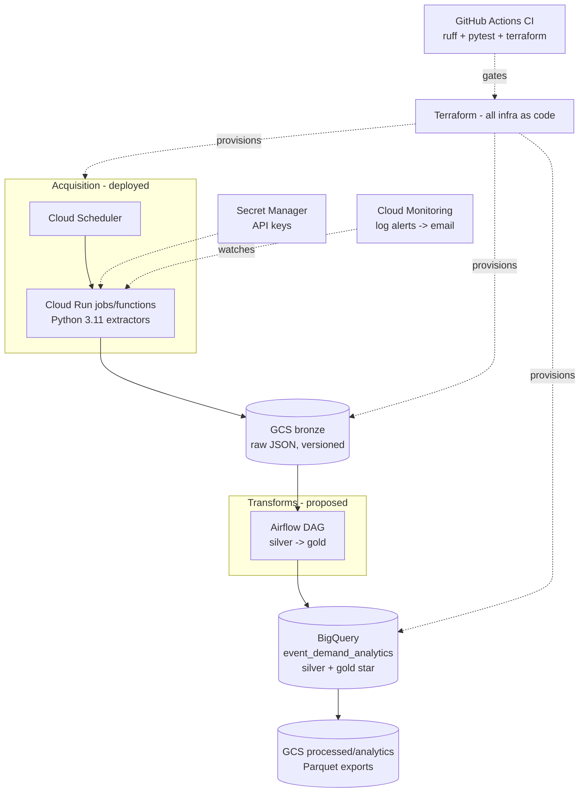

# Early tech stack

*Midterm Design Pitch · MSDS 683. Tools/services + why each. Most of this is
already deployed on GCP (project `data-architecture-498123`). Last updated 2026-06-15.*

## Diagram

## Components

| Layer | Tool | Role | Why this / alternative |
|---|---|---|---|
| **Compute** | **Cloud Run** jobs + functions (Python 3.11) | Run the API extractors on a schedule; serverless, scale-to-zero | Cheap for bursty daily jobs; no cluster to manage. *Alt: Cloud Functions only (fine for TM), but Run handles longer backfills.* |
| **Orchestration (acquire)** | **Cloud Scheduler** | Fire each daily extractor | Acquisition has no cross-task deps → a cron trigger is enough. |
| **Orchestration (transform)** | **Airflow** *(proposed)* | DAG for silver→gold: ordering, retries, DQ gates | Rubric learning goal + the real dependency graph lives here. *Alt: Cloud Composer (managed but ~$300+/mo — too heavy); likely lightweight Docker Airflow.* |
| **Storage — lake** | **GCS** medallion buckets (`-raw` / `-processed` / `-analytics`) | Bronze raw JSON (versioned) + processed/gold Parquet | Cheap, durable, decoupled from compute; partitioned by `dt=`. |
| **Storage — warehouse** | **BigQuery** (`event_demand_analytics`) | Silver + gold star tables; OLAP queries | Serverless columnar warehouse; pay-per-query; native Parquet/GCS. *Alt: Snowflake — more ops/cost for a class project.* |
| **IaC / bonus** | **Terraform** | All buckets, datasets, jobs, schedulers, IAM as code | Rubric **bonus** (+pts) and reproducible infra. |
| **Secrets** | **Secret Manager** | API keys (Ticketmaster, YouTube, SeatGeek) | Keeps keys out of code/logs; injected into Cloud Run. |
| **Monitoring** | **Cloud Monitoring** | Log-based alerts → email on run failures | Catch silent extractor failures (partial-failure alerting). |
| **CI** | **GitHub Actions** | ruff + pytest + `terraform fmt/validate` on every push | Green-gate before merge; keeps the repo honest. |
| **Lang/env** | Python 3.11, conda `music-demand` | Extractors, transforms, profiling | Std-lib-first POCs; pinned deps where needed (pytrends/pandas). |

## Sources (the data layer)

| Source | Gives | Status |
|---|---|---|
| **Ticketmaster** (Discovery v2) | Event spine, venue, genre, face-value price (~23% cover) | ✅ live nationwide |
| **SeatGeek** (Platform v2) | Secondary price + `listing_count` (resale demand), sometimes capacity | 🧪 local POC (access TBC) |
| **Google Trends** (pytrends) | Per-DMA local search interest + history (the geo backbone) | ✅ live |
| **YouTube** (Data v3) | Global artist popularity (subs, views) | ✅ live |

## One-line justification (for the slide)

> Serverless GCP medallion: **Cloud Run + Scheduler** land raw API snapshots in
> **GCS (bronze)**; **Airflow** transforms them into a **BigQuery** star; all
> provisioned with **Terraform**, secrets in **Secret Manager**, watched by
> **Cloud Monitoring**, gated by **GitHub Actions CI**. Chosen for low cost,
> scale-to-zero, and reproducibility.
