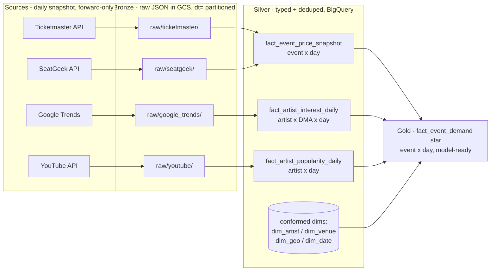

# Transformation pipeline

*Midterm Design Pitch · MSDS 683. The flow from raw API data → model-ready tables,
each step labeled with what it does. Table names match `schema_decision.md`. Last
updated 2026-06-15.*

**Shape:** a medallion lakehouse on GCP — **bronze** (raw JSON in GCS) → **silver**
(typed, deduped per-source tables in BigQuery) → **gold** (the joined star). A
**daily batch** processes *yesterday's* snapshot partitions; everything is
**idempotent** (re-running a day is a no-op).

---

## End-to-end diagram



---

## Step-by-step (what each transformation does)

### Bronze → land raw (one capture per source per day)
- **Parse + wrap** each API response; **append** as JSON under
  `gs://…-raw/<source>/dt=YYYY-MM-DD/…` (Hive-partitioned). No mutation — bronze is
  the replayable history. *(Already live for all four via `common/gcs_io.upload_raw`;
  Ticketmaster's is in `cloud_functions/ticketmaster_daily/main.py`.)*

### Silver → one typed, deduped fact per source grain
- **Ticketmaster + SeatGeek → `fact_event_price_snapshot`** (grain: event × day):
  flatten nested JSON → **standardize** dates to UTC + types → **normalize artist
  name** (for the join) → **dedupe** to one row per event (MERGE on `event_id`,
  the live `tm_events` pattern) → **append today's snapshot**. SeatGeek adds
  `listing_count` + secondary `lowest_price`; both sources fill the same price columns
  (source-tagged), so the schema is **source-agnostic on price**.
- **Google Trends → `fact_artist_interest_daily`** (grain: artist × DMA × day):
  explode the `records` arrays → **standardize** dates → **map DMA → geo** via the
  committed crosswalk (`google_trends_api/geo_lookup.py`) → keep the 0–100
  `local_interest_index` (relative within (artist, geo, window)) + the national series.
- **YouTube → `fact_artist_popularity_daily`** (grain: artist × day):
  parse channel stats → **standardize** → one row per (artist, day): subscribers, views.
- **Build conformed dims:** `dim_artist` (every artist seen in events — *not* filtered
  to the Trends roster), `dim_venue` (+ `dma_code` from the crosswalk, + `capacity`
  from a one-off web/Wikipedia gather), `dim_geo`, `dim_date`.

### Gold → assemble the star
- **`fact_event_demand`** (grain: event × day): start from
  `fact_event_price_snapshot` (the spine) and **LEFT JOIN**:
  - local interest from `fact_artist_interest_daily` on **(artist, venue's DMA, date)**,
  - global popularity from `fact_artist_popularity_daily` on **(artist, date)**,
  - dims on their keys.
  LEFT join = **every event is kept**; interest/popularity are `NULL` where collection
  hasn't reached that artist yet (never an event filter).
- **Derive features:** `days_to_show`, price deltas vs. prior snapshot, interest
  trajectory — the inputs to the demand/sell-out score (use cases in `schema_decision.md`).

---

## Cadence & orchestration

- **Daily batch, on yesterday's `dt=` partitions** — signals move on a daily cadence,
  so daily granularity loses nothing and is cheap. Idempotent MERGE / `CREATE OR
  REPLACE` so re-runs are safe.
- **Split (decided with the team):**
  - **Acquisition** (API → bronze): stays on **Cloud Scheduler → Cloud Run** — no
    cross-task dependencies, so a full orchestrator would be overkill.
  - **Silver → gold transforms**: an **Airflow DAG** (cross-source joins, task
    ordering, retries, data-quality gates) — this is where orchestration earns its
    place and satisfies the rubric's Airflow learning goal.

```
[Cloud Scheduler] --daily--> [Cloud Run: extractors] --> BRONZE (GCS)
                                                            |
                                  [Airflow DAG] -----------> SILVER --> GOLD (BigQuery)
                                  (build dims -> facts -> fact_event_demand -> DQ check)
```

---

## Status (what's built vs. proposed)

| Stage | Ticketmaster | SeatGeek | Google Trends | YouTube |
|---|---|---|---|---|
| Bronze | ✅ live | 🧪 local POC | ✅ live | ✅ live |
| Silver | ✅ `tm_events` | ⬜ proposed | ⬜ proposed | ⬜ proposed |
| Gold | ⬜ proposed (the demo target) | | | |

Everything past silver is **proposed** for the pitch — that's expected at the
midterm ("ok if you're still figuring out technical things"). The labeled steps
above are the build plan.
