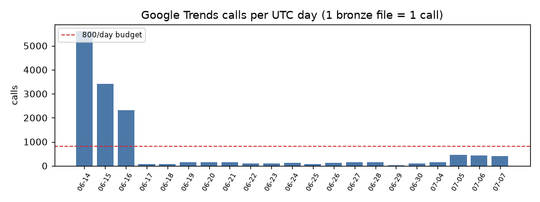
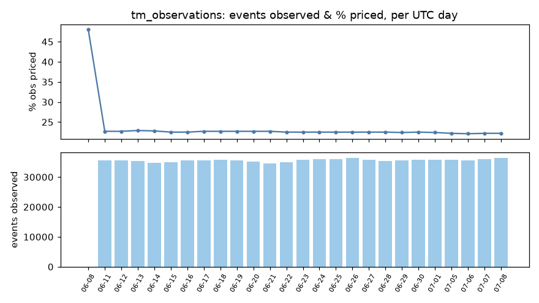
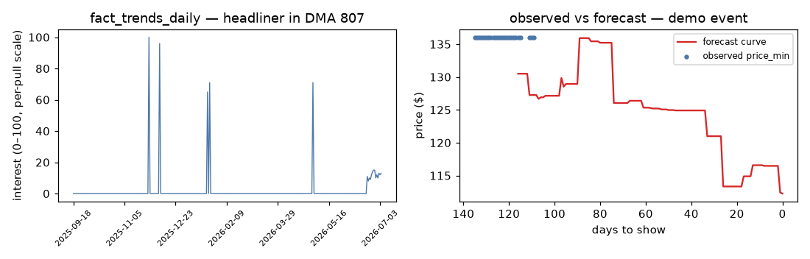
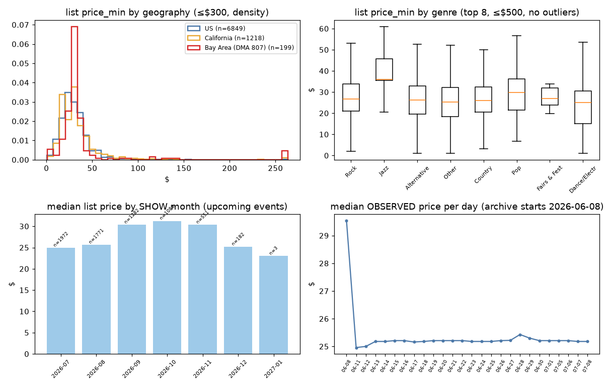
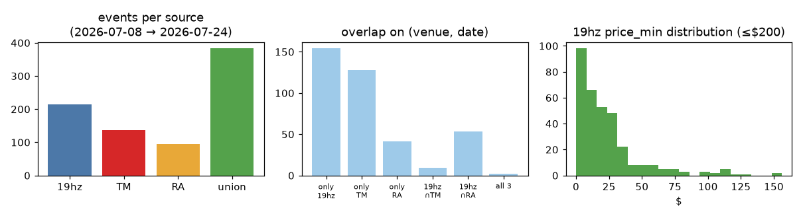
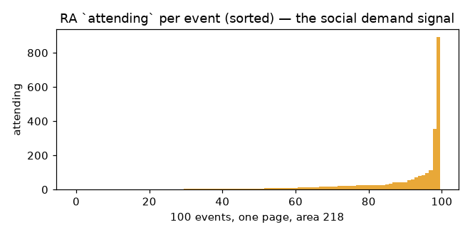

# Data review — bronze → gold, all sources

Generated 2026-07-08T09:06:57+00:00 by `eda/data_review.py` (project `data-architecture-498123`, dataset `event_demand_analytics`). Re-run the same command to refresh; narrative companion: `eda/data_review_2026-07.md`.

## Bronze inventory (`gs://<project>-raw/<source>/dt=<UTC-day>/`)

| source | partitions | first | last | files_latest | total_MiB |
|---|---|---|---|---|---|
| ticketmaster | 26 | 2026-06-08 | 2026-07-08 | 51 | 46,247.6 |
| google_trends | 21 | 2026-06-14 | 2026-07-07 | 392 | 324.9 |
| youtube | 21 | 2026-06-14 | 2026-07-07 | 1 | 4.0 |
| nineteenhz | 1 | 2026-07-08 | 2026-07-08 | 1 | 0.2 |
| ra | 1 | 2026-07-08 | 2026-07-08 | 1 | 0.1 |
| ticketpages | 1 | 2026-07-08 | 2026-07-08 | 1 | 0.1 |

Google Trends calls/day = files/day (one file per API call; the same
ledger as `google_trends_api/check_call_rate.py`). Last 7 partitions:

| dt (UTC) | calls |
|---|---|
| 2026-06-28 | 145 |
| 2026-06-29 | 28 |
| 2026-06-30 | 89 |
| 2026-07-04 | 156 |
| 2026-07-05 | 460 |
| 2026-07-06 | 434 |
| 2026-07-07 | 392 |



## Raw-format samples (newest capture per source family)

### Ticketmaster — one Discovery event (of a per-state JSON array; `images`/`_links` omitted for brevity)

`gs://data-architecture-498123-raw/ticketmaster/dt=2026-07-08/ticketmaster_CA_20260708T010002Z.json`

```json
{
  "name": "Elevation Rhythm - The Goodbye Yesterday Tour",
  "type": "event",
  "id": "G5vYZ_k3MJLRf",
  "test": false,
  "url": "https://www.ticketmaster.com/elevation-rhythm-the-goodbye-yesterday-tour-sacramento-california-07-07-2026/event/1C006464…",
  "locale": "en-us",
  "sales": {
    "public": {
      "startDateTime": "2026-03-06T18:00:00Z",
      "startTBD": false,
      "startTBA": false,
      "endDateTime": "2026-07-08T03:30:00Z"
    },
    "presales": [
      {
        "startDateTime": "2026-03-05T18:00:00Z",
        "endDateTime": "2026-07-01T05:00:00Z",
        "name": "VIP Packages"
      },
      {
        "startDateTime": "2026-03-05T18:00:00Z",
        "endDateTime": "2026-03-06T18:00:00Z",
        "name": "TICKET HOLDER PRE-SALE"
      }
    ]
  },
  "dates": {
    "start": {
      "localDate": "2026-07-07",
      "localTime": "18:30:00",
      "dateTime": "2026-07-08T01:30:00Z",
      "dateTBD": false,
      "dateTBA": false,
      "timeTBA": false,
      "noSpecificTime": false
    },
    "timezone": "America/Los_Angeles",
    "status": {
      "code": "onsale"
    },
    "spanMultipleDays": false
  },
  "classifications": [
    {
      "primary": true,
      "segment": {
        "id": "KZFzniwnSyZfZ7v7nJ",
        "name": "Music"
      },
      "genre": {
        "id": "KnvZfZ7vAe7",
        "name": "Religious"
      },
      "subGenre": {
        "id": "KZazBEonSMnZfZ7v6ea",
        "name": "Gospel"
      },
      "type": {
        "id": "KZAyXgnZfZ7v7nI",
        "name": "Undefined"
      },
      "subType": {
        "id": "KZFzBErXgnZfZ7v7lJ",
        "name": "Undefined"
      },
      "family": false
    }
  ],
  "promoter": {
    "id": "653",
    "name": "LIVE NATION MUSIC",
    "description": "LIVE NATION MUSIC / NTL / USA"
  },
  "promoters": [
    {
      "id": "653",
      "name": "LIVE NATION MUSIC",
      "description": "LIVE NATION MUSIC / NTL / USA"
    }
  ],
  "info": "DOORS:6:30pm SHOW:7:30pm This is an all ages show - everyone is welcome. NO RE-ENTRY All schedules and support bands are…",
  "products": [
    {
      "name": "Fast Lane Access - Elevation Rhythm - Not a Concert Ticket",
      "id": "G5vYZ_kKIRaEc",
      "url": "https://www.ticketmaster.com/fast-lane-access-elevation-rhythm-not-sacramento-california-07-07-2026/event/1C006464E8BC99…",
      "type": "Special Entry",
      "classifications": [
        {
          "primary": true,
          "segment": "{… 2 keys}",
          "genre": "{… 2 keys}",
          "subGenre": "{… 2 keys}",
          "type": "{… 2 keys}",
          "subType": "{… 2 keys}",
          "family": false
        }
      ]
    },
    {
      "name": "Good Luck Lounge Access- Elevation Rhythm - Not a Concert Ticket",
      "id": "G5vYZ_kKtJacX",
      "url": "https://www.ticketmaster.com/good-luck-lounge-access-elevation-rhythm-sacramento-california-07-07-2026/event/1C006464E99…",
      "type": "Club Access",
      "classifications": [
        {
          "primary": true,
          "segment": "{… 2 keys}",
          "genre": "{… 2 keys}",
          "subGenre": "{… 2 keys}",
          "type": "{… 2 keys}",
          "subType": "{… 2 keys}",
          "family": false
        }
      ]
    },
    "... 3 more items"
  ],
  "seatmap": {
    "staticUrl": "https://mapsapi.tmol.io/maps/geometry/3/event/1C006464B799FBD4/staticImage?type=png&systemId=HOST"
  },
  "accessibility": {
    "info": "There is a special seating area for those with mobility limitations. We are able to accommodate up to two people per par…"
  },
  "ticketLimit": {
    "info": "Please note, there is an 8 ticket limit on this event."
  },
  "ageRestrictions": {
    "legalAgeEnforced": false
  },
  "ticketing": {
    "safeTix": {
      "enabled": true
    },
    "allInclusivePricing": {
      "enabled": true
    }
  },
  "nameOrigin": "custom",
  "ticketTextLines": {
    "en-us": {
      "line6": "TUE JUL 07 2026 DRS 630PM ",
      "line5": "1417 R STREET * SACRAMENTO",
      "line4": "      ACE OF SPADES       ",
      "line3": " The GoodbyeYesterdayTour ",
      "line2": "     Elevation Rhythm     ",
      "line1": "      TPR. Presents       "
    }
  },
  "_embedded": {
    "venues": [
      {
        "name": "Ace of Spades",
        "type": "venue",
        "id": "KovZpZAJ6lvA",
        "test": false,
        "url": "https://www.ticketmaster.com/ace-of-spades-tickets-sacramento/venue/229953",
        "locale": "en-us",
        "postalCode": "95811",
        "timezone": "America/Los_Angeles",
        "city": {
          "name": "Sacramento"
        },
        "state": {
          "name": "California",
          "stateCode": "CA"
        },
        "country": {
          "name": "United States Of America",
          "countryCode": "US"
        },
        "address": {
          "line1": "1417 R St."
        },
        "location": {
          "longitude": "-121.49087928",
          "latitude": "38.56999300"
        },
        "markets": [
          "{… 2 keys}"
        ],
        "dmas": [
          "{… 1 keys}",
          "{… 1 keys}",
          "... 5 more items"
        ],
        "boxOfficeInfo": {
          "openHoursDetail": "Ace of Spades Box office is open on Show nights 2 hours prior to doors and 5-9 Thursday - Saturday.",
          "acceptedPaymentDetail": "Ace of Spades is Cashless we accept all Major Credit Cards.",
          "willCallDetail": "Will call tickets can only be picked up at the venue Box Office on the night of the event. The original purchaser must b…"
        },
        "parkingDetail": "Nearby street parking is available. Additonal Parking is available for $5/space at the SEIU parking lot on R Street betw…",
        "accessibleSeatingDetail": "Yes! Ace of Spades strives to make our venue and live experiences inclusive and accessible. For more questions, or infor…",
        "generalInfo": {
          "generalRule": "All events are all ages unless otherwise noted. All attendees are required to purchase a full price ticket regardless of…",
          "childRule": "Children ages 3 and under do not need a ticket. Some events may have age restrictions in place so please check our websi…"
        },
        "upcomingEvents": {
          "ticketmaster": 59,
          "_total": 59,
          "_filtered": 0
        },
        "ada": {
          "adaPhones": "Please visit https://www.aceofspadessac.com/accessibility for accessibility information and contact options.",
          "adaCustomCopy": "For information about accessible seating, accommodations, and venue access, please visit the Ace of Spades accessibility…",
          "adaHours": "The Ace of Spades Box Office opens 1 hour before doors on show days only."
        }
      }
    ],
    "attractions": [
      {
        "name": "Elevation Rhythm",
        "type": "attraction",
        "id": "K8vZ917hd50",
        "test": false,
        "url": "https://www.ticketmaster.com/elevation-rhythm-tickets/artist/2967739",
        "locale": "en-us",
        "externalLinks": {
          "musicbrainz": "[… 1 items]"
        },
        "classifications": [
          "{… 7 keys}"
        ],
        "upcomingEvents": {
          "ticketmaster": 18,
          "ticketweb": 2,
          "_total": 20,
          "_filtered": 0
        }
      }
    ]
  }
}
```

### Google Trends — iot national (daily series, geo=US)

`gs://data-architecture-498123-raw/google_trends/dt=2026-07-07/google_trends_iot_US_veggi_20260707T165438Z.json`

```json
{
  "source": "google_trends",
  "endpoint": "interest_over_time",
  "extract_ts_utc": "2026-07-07T16:54:38+00:00",
  "artist": "veggi",
  "query": "veggi",
  "geo": "US",
  "geo_code": "US",
  "resolution": "national",
  "timeframe": "2025-10-11 2026-07-07",
  "granularity": "daily",
  "n_records": 270,
  "records": [
    {
      "date": "2025-10-11T00:00:00.000",
      "veggi": 0,
      "isPartial": false
    },
    {
      "date": "2025-10-12T00:00:00.000",
      "veggi": 0,
      "isPartial": false
    },
    {
      "date": "2025-10-13T00:00:00.000",
      "veggi": 0,
      "isPartial": false
    },
    "... 267 more items"
  ]
}
```

### Google Trends — iot per-DMA (daily series, geo=US-XX-DMA)

`gs://data-architecture-498123-raw/google_trends/dt=2026-07-07/google_trends_iot_US-WA-819_Temples_20260707T185811Z.json`

```json
{
  "source": "google_trends",
  "endpoint": "interest_over_time",
  "extract_ts_utc": "2026-07-07T18:58:11+00:00",
  "artist": "Temples",
  "query": "Temples",
  "geo": "US-WA-819",
  "geo_code": "US-WA-819",
  "resolution": "dma_series",
  "timeframe": "2025-10-11 2026-07-07",
  "granularity": "daily",
  "n_records": 270,
  "records": [
    {
      "date": "2025-10-11T00:00:00.000",
      "Temples": 0,
      "isPartial": false
    },
    {
      "date": "2025-10-12T00:00:00.000",
      "Temples": 0,
      "isPartial": false
    },
    {
      "date": "2025-10-13T00:00:00.000",
      "Temples": 0,
      "isPartial": false
    },
    "... 267 more items"
  ]
}
```

### Google Trends — ibr DMA snapshot (cross-DMA cross-section)

`gs://data-architecture-498123-raw/google_trends/dt=2026-07-07/google_trends_ibr_DMA_paris-jackson_20260707T162935Z.json`

```json
{
  "source": "google_trends",
  "endpoint": "interest_by_region",
  "extract_ts_utc": "2026-07-07T16:29:35+00:00",
  "artist": "paris jackson",
  "query": "paris jackson",
  "geo": "US",
  "geo_code": null,
  "resolution": "DMA",
  "timeframe": "today 12-m",
  "granularity": "snapshot",
  "n_records": 210,
  "records": [
    {
      "geoName": "Abilene-Sweetwater TX",
      "geoCode": "662",
      "paris jackson": 10
    },
    {
      "geoName": "Albany GA",
      "geoCode": "525",
      "paris jackson": 8
    },
    {
      "geoName": "Albany-Schenectady-Troy NY",
      "geoCode": "532",
      "paris jackson": 10
    },
    "... 207 more items"
  ]
}
```

### YouTube — daily channel-stats rollup

`gs://data-architecture-498123-raw/youtube/dt=2026-07-07/youtube_20260707T163128Z.json`

```json
{
  "source": "youtube",
  "extract_ts_utc": "2026-07-07T16:31:28+00:00",
  "n_records": 398,
  "records": [
    {
      "query": "Chasing Abbey",
      "official_channel_id": "UCjQSj96YTCBJWNNHyROnk-A",
      "official_channel_title": "Chasing Abbey",
      "official_subscribers": 35700,
      "official_total_views": 8404106,
      "official_video_count": 94,
      "topic_channel_id": "UC1-VefzIMgLBHCcQZuE_MfA",
      "topic_channel_title": "Chasing Abbey - Topic",
      "topic_total_views": 3640695,
      "topic_video_count": 27
    },
    {
      "query": "Temples",
      "official_channel_id": "UCdorDsEgYHYAFhWC2a2l8YA",
      "official_channel_title": "TemplesOfficial",
      "official_subscribers": 63300,
      "official_total_views": 24638375,
      "official_video_count": 51,
      "topic_channel_id": "UCAwEVNrw_7At5j2ccsDc_wQ",
      "topic_channel_title": "Temples - Topic",
      "topic_total_views": 9948939,
      "topic_video_count": 291
    },
    {
      "query": "Slow Magic",
      "official_channel_id": "UCd9ZxP1w4-8TGlbjdDEoh5A",
      "official_channel_title": "Slow Magic",
      "official_subscribers": 10500,
      "official_total_views": 3421241,
      "official_video_count": 407,
      "topic_channel_id": "UCmUORL97OeG5TxWhVAsB40Q",
      "topic_channel_title": "Slow Magic - Topic",
      "topic_total_views": 1936905,
      "topic_video_count": 198
    },
    "... 395 more items"
  ]
}
```

### 19hz.info — raw listing HTML (bronze is the untouched page)

`gs://data-architecture-498123-raw/nineteenhz/dt=2026-07-08/nineteenhz_bayarea_20260708T075234Z.html` (excerpt at first `<tr>`)

```html
<tr>
            <th class="table-date">Date/Time</th>
            <th>Event Title @ Venue</th>
            <th>Tags</th>
            <th>Price | Age</th>
            <th>Organizers</th>
            <th>Links</th>
            <th></th>
        </tr></thead>
	    <tbody>
			<tr><td>Mon: Jul 6-Wed: Jul 15 <br />(Mon: 3pm-Wed: 3pm)</td><td><a href='https://www.mutantfest.org/'>Autonomous Mutant Festival</a> @ TBA (Cascadia)<td>multigenre dance</td><td>free</td><td></td><td><a href='https://www.instagram.com/p/DZiZv3yjxIu/?img_index=1'>Instagram Page</a><br /></td><td><div class='shrink'>2026/07/06</div></td></tr><tr><td>Tue: Jul 7 <br />(8pm-12am)</td><td><a href='https://www.instagram.com/p/DaQ6ZShSLfs/'>WTF: Fundraiser for SFPD Victims w/ 2Dahlia, Lilotus, The Baptist, Del, Ms.Smith</a> @ The Stud (San Francisco)<td>techno, breaks, dub, dubstep, bass music, house</td><td>donations notaflof | 21+</td><td>Age of Sin</td><td></td><td><div class='shrink'>2026/07/07</div></td></tr><tr><td>Tue: Jul 7 <br />(9pm-2am)</td><td><a href='https://ra.co/events/2456309'>Interzone Darkwave Tuesdays</a> @ F8 1192 Folsom (San Francisco)<td>darkwave</td><td>free b4 1030 / $5 | 21+</td><td>Hex Embrace
```

Parsed row (committed `eda/output/nineteenhz_events.csv`):

```json
{
  "event_date": "2026-07-06",
  "datetime_text": "Mon: Jul 6-Wed: Jul 15  (Mon: 3pm-Wed: 3pm)",
  "title": "Autonomous Mutant Festival",
  "venue": "TBA",
  "city": "Cascadia",
  "genres": "multigenre dance",
  "price_text": "free",
  "age_restriction": "",
  "is_free": "True",
  "price_min": "0.0",
  "price_max": "0.0",
  "price_open_ended": "False",
  "organizers": "",
  "artists": "Autonomous Mutant Festival",
  "n_artists": "1",
  "ticket_url": "https://www.mutantfest.org/",
  "ticket_domain": "mutantfest.org",
  "extract_ts_utc": "2026-07-08T07:52:33+00:00"
}
```

### Resident Advisor — GraphQL eventListings response

`gs://data-architecture-498123-raw/ra/dt=2026-07-08/ra_bayarea_20260708T075250Z.json`

```json
{
  "request_variables": {
    "filters": {
      "areas": {
        "eq": 218
      },
      "listingDate": {
        "gte": "2026-07-08T00:00:00.000Z",
        "lte": "2026-09-06T23:59:59.999Z"
      }
    },
    "pageSize": 100,
    "page": 1
  },
  "extract_ts_utc": "2026-07-08T07:52:50+00:00",
  "response": {
    "data": {
      "eventListings": {
        "data": [
          {
            "event": {
              "id": "2480119",
              "title": "Run it Back presents Trevor's Birthday Jam Feat. starfari and Clayton Williams",
              "date": "2026-07-08T00:00:00.000",
              "startTime": "2026-07-08T21:00:00.000",
              "endTime": "2026-07-09T02:00:00.000",
              "attending": 12,
              "isTicketed": true,
              "cost": "0-10",
              "contentUrl": "/events/2480119",
              "venue": {
                "id": "91478",
                "name": "F8 1192 Folsom"
              },
              "artists": [
                {
                  "id": "161904",
                  "name": "starfari"
                },
                {
                  "id": "150949",
                  "name": "DJ Parrot"
                },
                "... 2 more items"
              ],
              "genres": [
                {
                  "name": "Techno"
                },
                {
                  "name": "Tech House"
                }
              ]
            }
          },
          {
            "event": {
              "id": "2476779",
              "title": "ITALO FRISCO",
              "date": "2026-07-08T00:00:00.000",
              "startTime": "2026-07-08T21:30:00.000",
              "endTime": "2026-07-09T01:30:00.000",
              "attending": 8,
              "isTicketed": false,
              "cost": "0",
              "contentUrl": "/events/2476779",
              "venue": {
                "id": "11134",
                "name": "Madrone Art Bar"
              },
              "artists": [
                {
                  "id": "96475",
                  "name": "Nino Msk"
                }
              ],
              "genres": [
                {
                  "name": "House"
                },
                {
                  "name": "Acid"
                }
              ]
            }
          },
          "... 98 more items"
        ],
        "totalResults": 176
      }
    }
  }
}
```

### Ticket pages — schema.org JSON-LD offers (first page payload)

`gs://data-architecture-498123-raw/ticketpages/dt=2026-07-08/ticketpages_jsonld_20260708T075528Z.json`

```json
{
  "ticket_url": "https://shotgun.live/en/events/ffdjuly26",
  "extract_ts_utc": "2026-07-08T07:53:06+00:00",
  "event_ld": [
    {
      "@context": "https://schema.org",
      "@type": "MusicEvent",
      "name": "Five Finger Disco: Fever",
      "url": "https://shotgun.live/en/events/ffdjuly26",
      "image": "https://res.cloudinary.com/shotgun/image/upload/c_limit,w_1200,h_630/f_jpg/q_auto/c_limit,f_auto,fl_lossy,q_auto,w_1920/v1781244224/production/artworks/FFD_July…",
      "startDate": "2026-07-12T04:00:00.000Z",
      "doorTime": "2026-07-12T04:00:00.000Z",
      "endDate": "2026-07-12T09:00:00.000Z",
      "eventStatus": "https://schema.org/EventScheduled",
      "eventAttendanceMode": "https://schema.org/OfflineEventAttendanceMode",
      "location": {
        "@type": "Place",
        "name": "White Horse Inn",
        "address": {
          "@type": "PostalAddress",
          "streetAddress": "6551 Telegraph Avenue, Oakland, CA 94609, USA",
          "addressLocality": "Oakland",
          "postalCode": "94609",
          "addressCountry": "US"
        },
        "geo": {
          "@type": "GeoCoordinates",
          "latitude": 37.8518352,
          "longitude": -122.2606209
        }
      },
      "description": "The Summer haze is setting in, and Five Finger Disco is here to make you SWEAT!\n\nWe're bringing back Oakland Royalty and one of our favs, Amal, for an extended …",
      "organizer": {
        "@type": "LocalBusiness",
        "name": "Charles Hawthorne",
        "url": "https://shotgun.live/en/venues/charles-hawthorne"
      },
      "performer": [
        {
          "@type": "MusicGroup",
          "name": "AMAL",
          "url": "https://shotgun.live/en/artists/djemelle"
        },
        {
          "@type": "MusicGroup",
          "name": "Charles Hawthorne",
          "url": "https://shotgun.live/en/artists/charles-hawthorne-4"
        }
      ],
      "offers": [
        {
          "@type": "Offer",
          "availability": "https://schema.org/InStock",
          "name": "General Admission",
          "price": 10,
          "priceCurrency": "USD",
          "validFrom": "2026-06-12T15:57:55.000Z",
          "url": "https://shotgun.live/en/events/ffdjuly26"
        },
        {
          "@type": "Offer",
          "availability": "https://schema.org/InStock",
          "name": "Pay-It-Forward Admission",
          "price": 15,
          "priceCurrency": "USD",
          "validFrom": "2026-06-12T15:57:55.000Z",
          "url": "https://shotgun.live/en/events/ffdjuly26"
        }
      ]
    }
  ]
}
```


## Field inventory — every raw field each API returns

Measured from real captures (`fill` = % of sampled records where the path occurs; `[]` = list element). This is the observed contract, not the documented one.

### Ticketmaster Discovery `events.json` — 5062 events (newest CA capture)

We keep ~30 of these paths (see `flatten_event` in the TM cloud function); the rest land untouched in bronze for replay.

| field | types | fill |
|---|---|---|
| _embedded.attractions[]._links.self.href | str | 86% |
| _embedded.attractions[].aliases[] | str | 5% |
| _embedded.attractions[].classifications[].family | bool | 86% |
| _embedded.attractions[].classifications[].genre.id | str | 86% |
| _embedded.attractions[].classifications[].genre.name | str | 86% |
| _embedded.attractions[].classifications[].primary | bool | 86% |
| _embedded.attractions[].classifications[].segment.id | str | 86% |
| _embedded.attractions[].classifications[].segment.name | str | 86% |
| _embedded.attractions[].classifications[].subGenre.id | str | 86% |
| _embedded.attractions[].classifications[].subGenre.name | str | 86% |
| _embedded.attractions[].classifications[].subType.id | str | 84% |
| _embedded.attractions[].classifications[].subType.name | str | 84% |
| _embedded.attractions[].classifications[].type.id | str | 84% |
| _embedded.attractions[].classifications[].type.name | str | 84% |
| _embedded.attractions[].draftStatus | str | 12% |
| _embedded.attractions[].externalLinks.bandcamp[].url | str | 1% |
| _embedded.attractions[].externalLinks.facebook[].url | str | 56% |
| _embedded.attractions[].externalLinks.homepage[].url | str | 55% |
| _embedded.attractions[].externalLinks.instagram[].url | str | 61% |
| _embedded.attractions[].externalLinks.itunes[].url | str | 51% |
| _embedded.attractions[].externalLinks.lastfm[].url | str | 22% |
| _embedded.attractions[].externalLinks.musicbrainz[].id | str | 59% |
| _embedded.attractions[].externalLinks.musicbrainz[].url | str | 59% |
| _embedded.attractions[].externalLinks.soundcloud[].url | str | 1% |
| _embedded.attractions[].externalLinks.spotify[].url | str | 58% |
| _embedded.attractions[].externalLinks.tiktok[].url | str | 4% |
| _embedded.attractions[].externalLinks.twitter[].url | str | 52% |
| _embedded.attractions[].externalLinks.vevo[].url | str | 0% |
| _embedded.attractions[].externalLinks.wiki[].url | str | 33% |
| _embedded.attractions[].externalLinks.youtube[].url | str | 53% |
| _embedded.attractions[].id | str | 86% |
| _embedded.attractions[].images[].attribution | str | 1% |
| _embedded.attractions[].images[].fallback | bool | 86% |
| _embedded.attractions[].images[].height | int | 86% |
| _embedded.attractions[].images[].ratio | str | 86% |
| _embedded.attractions[].images[].url | str | 86% |
| _embedded.attractions[].images[].width | int | 86% |
| _embedded.attractions[].locale | str | 86% |
| _embedded.attractions[].name | str | 86% |
| _embedded.attractions[].test | bool | 86% |
| _embedded.attractions[].type | str | 86% |
| _embedded.attractions[].upcomingEvents._filtered | int | 86% |
| _embedded.attractions[].upcomingEvents._total | int | 86% |
| _embedded.attractions[].upcomingEvents.crowder | int | 2% |
| _embedded.attractions[].upcomingEvents.mfx-ae | int | 0% |
| _embedded.attractions[].upcomingEvents.mfx-at | int | 1% |
| _embedded.attractions[].upcomingEvents.mfx-be | int | 4% |
| _embedded.attractions[].upcomingEvents.mfx-ch | int | 3% |
| _embedded.attractions[].upcomingEvents.mfx-cz | int | 3% |
| _embedded.attractions[].upcomingEvents.mfx-de | int | 7% |
| _embedded.attractions[].upcomingEvents.mfx-dk | int | 4% |
| _embedded.attractions[].upcomingEvents.mfx-es | int | 3% |
| _embedded.attractions[].upcomingEvents.mfx-fi | int | 2% |
| _embedded.attractions[].upcomingEvents.mfx-it | int | 2% |
| _embedded.attractions[].upcomingEvents.mfx-nl | int | 11% |
| _embedded.attractions[].upcomingEvents.mfx-no | int | 5% |
| _embedded.attractions[].upcomingEvents.mfx-pl | int | 4% |
| _embedded.attractions[].upcomingEvents.mfx-se | int | 3% |
| _embedded.attractions[].upcomingEvents.mfx-za | int | 0% |
| _embedded.attractions[].upcomingEvents.moshtix | int | 3% |
| _embedded.attractions[].upcomingEvents.mticket | int | 3% |
| _embedded.attractions[].upcomingEvents.sportxtr | int | 0% |
| _embedded.attractions[].upcomingEvents.ticketmaster | int | 78% |
| _embedded.attractions[].upcomingEvents.ticketnet | int | 0% |
| _embedded.attractions[].upcomingEvents.ticketweb | int | 38% |
| _embedded.attractions[].upcomingEvents.tixcraft-ph | int | 0% |
| _embedded.attractions[].upcomingEvents.tixcraft-sg | int | 0% |
| _embedded.attractions[].upcomingEvents.tmc | int | 0% |
| _embedded.attractions[].upcomingEvents.tmr | int | 60% |
| _embedded.attractions[].upcomingEvents.trium | int | 11% |
| _embedded.attractions[].upcomingEvents.universe | int | 11% |
| _embedded.attractions[].upcomingEvents.veeps | int | 0% |
| _embedded.attractions[].upcomingEvents.wts-tr | int | 1% |
| _embedded.attractions[].url | str | 84% |
| _embedded.venues[]._links.self.href | str | 100% |
| _embedded.venues[].accessibleSeatingDetail | str | 31% |
| _embedded.venues[].ada.adaCustomCopy | str | 7% |
| _embedded.venues[].ada.adaHours | str | 6% |
| _embedded.venues[].ada.adaPhones | str | 7% |
| _embedded.venues[].address.line1 | str | 100% |
| _embedded.venues[].address.line2 | str | 4% |
| _embedded.venues[].aliases[] | str | 4% |
| _embedded.venues[].boxOfficeInfo.acceptedPaymentDetail | str | 33% |
| _embedded.venues[].boxOfficeInfo.openHoursDetail | str | 32% |
| _embedded.venues[].boxOfficeInfo.phoneNumberDetail | str | 23% |
| _embedded.venues[].boxOfficeInfo.willCallDetail | str | 26% |
| _embedded.venues[].city.name | str | 100% |
| _embedded.venues[].country.countryCode | str | 100% |
| _embedded.venues[].country.name | str | 100% |
| _embedded.venues[].dmas[].id | int | 71% |
| _embedded.venues[].externalLinks.appDeepLink[].url | str | 0% |
| _embedded.venues[].generalInfo.childRule | str | 32% |
| _embedded.venues[].generalInfo.generalRule | str | 36% |
| _embedded.venues[].id | str | 100% |
| _embedded.venues[].images[].fallback | bool | 43% |
| _embedded.venues[].images[].height | int | 43% |
| _embedded.venues[].images[].ratio | str | 43% |
| _embedded.venues[].images[].url | str | 43% |
| _embedded.venues[].images[].width | int | 43% |
| _embedded.venues[].locale | str | 100% |
| _embedded.venues[].location.latitude | str | 100% |
| _embedded.venues[].location.longitude | str | 100% |
| _embedded.venues[].markets[].id | str | 52% |
| _embedded.venues[].markets[].name | str | 52% |
| _embedded.venues[].name | str | 100% |
| _embedded.venues[].parkingDetail | str | 33% |
| _embedded.venues[].postalCode | str | 100% |
| _embedded.venues[].social.twitter.handle | str | 12% |
| _embedded.venues[].state.name | str | 100% |
| _embedded.venues[].state.stateCode | str | 100% |
| _embedded.venues[].test | bool | 100% |
| _embedded.venues[].timezone | str | 100% |
| _embedded.venues[].type | str | 100% |
| _embedded.venues[].upcomingEvents._filtered | int | 100% |
| _embedded.venues[].upcomingEvents._total | int | 100% |
| _embedded.venues[].upcomingEvents.archtics | int | 0% |
| _embedded.venues[].upcomingEvents.moshtix | int | 0% |
| _embedded.venues[].upcomingEvents.ticketmaster | int | 59% |
| _embedded.venues[].upcomingEvents.ticketweb | int | 31% |
| _embedded.venues[].upcomingEvents.tmr | int | 25% |
| _embedded.venues[].upcomingEvents.universe | int | 1% |
| _embedded.venues[].upcomingEvents.veeps | int | 0% |
| _embedded.venues[].url | str | 81% |
| _links.attractions[].href | str | 86% |
| _links.self.href | str | 100% |
| _links.venues[].href | str | 100% |
| accessibility.info | str | 5% |
| accessibility.ticketLimit | int | 35% |
| accessibility.url | str | 1% |
| accessibility.urlText | str | 1% |
| ageRestrictions.ageRuleDescription | str | 3% |
| ageRestrictions.legalAgeEnforced | bool | 51% |
| classifications[].family | bool | 100% |
| classifications[].genre.id | str | 100% |
| classifications[].genre.name | str | 100% |
| classifications[].primary | bool | 99% |
| classifications[].segment.id | str | 100% |
| classifications[].segment.name | str | 100% |
| classifications[].subGenre.id | str | 95% |
| classifications[].subGenre.name | str | 95% |
| classifications[].subType.id | str | 80% |
| classifications[].subType.name | str | 80% |
| classifications[].type.id | str | 80% |
| classifications[].type.name | str | 80% |
| dates.access.endApproximate | bool | 29% |
| dates.access.endDateTime | str | 3% |
| dates.access.startApproximate | bool | 29% |
| dates.access.startDateTime | str | 29% |
| dates.end.approximate | bool | 29% |
| dates.end.dateTime | str | 3% |
| dates.end.localDate | str | 3% |
| dates.end.localTime | str | 3% |
| dates.end.noSpecificTime | bool | 29% |
| dates.initialStartDate.dateTime | str | 1% |
| dates.initialStartDate.localDate | str | 1% |
| dates.initialStartDate.localTime | str | 1% |
| dates.spanMultipleDays | bool | 100% |
| dates.start.dateTBA | bool | 100% |
| dates.start.dateTBD | bool | 100% |
| dates.start.dateTime | str | 99% |
| dates.start.localDate | str | 100% |
| dates.start.localTime | str | 99% |
| dates.start.noSpecificTime | bool | 100% |
| dates.start.timeTBA | bool | 100% |
| dates.status.code | str | 100% |
| dates.timezone | str | 81% |
| description | str | 1% |
| doorsTimes.dateTime | str | 11% |
| doorsTimes.localDate | str | 11% |
| doorsTimes.localTime | str | 11% |
| id | str | 100% |
| images[].attribution | str | 1% |
| images[].fallback | bool | 100% |
| images[].height | int | 100% |
| images[].ratio | str | 100% |
| images[].url | str | 100% |
| images[].width | int | 100% |
| info | str | 58% |
| linkMoreInfo.descriptions.en-au | str | 14% |
| linkMoreInfo.descriptions.en-ca | str | 14% |
| linkMoreInfo.descriptions.en-mx | str | 14% |
| linkMoreInfo.descriptions.en-nz | str | 14% |
| linkMoreInfo.descriptions.en-us | str | 14% |
| linkMoreInfo.descriptions.es-br | str | 14% |
| linkMoreInfo.descriptions.es-mx | str | 14% |
| linkMoreInfo.descriptions.es-us | str | 14% |
| linkMoreInfo.descriptions.fr-ca | str | 14% |
| linkMoreInfo.descriptions.pt-br | str | 14% |
| linkMoreInfo.url | str | 14% |
| locale | str | 100% |
| name | str | 100% |
| nameOrigin | str | 100% |
| outlets[].type | str | 19% |
| outlets[].url | str | 19% |
| pleaseNote | str | 58% |
| priceRanges[].currency | str | 28% |
| priceRanges[].max | float | 28% |
| priceRanges[].min | float | 28% |
| priceRanges[].type | str | 28% |
| products[].classifications[].family | bool | 31% |
| products[].classifications[].genre.id | str | 31% |
| products[].classifications[].genre.name | str | 31% |
| products[].classifications[].primary | bool | 31% |
| products[].classifications[].segment.id | str | 31% |
| products[].classifications[].segment.name | str | 31% |
| products[].classifications[].subGenre.id | str | 31% |
| products[].classifications[].subGenre.name | str | 31% |
| products[].classifications[].subType.id | str | 31% |
| products[].classifications[].subType.name | str | 31% |
| products[].classifications[].type.id | str | 31% |
| products[].classifications[].type.name | str | 31% |
| products[].id | str | 31% |
| products[].name | str | 31% |
| products[].type | str | 31% |
| products[].url | str | 31% |
| promoter.description | str | 52% |
| promoter.id | str | 52% |
| promoter.name | str | 52% |
| promoters[].description | str | 52% |
| promoters[].id | str | 52% |
| promoters[].name | str | 52% |
| sales.presales[].description | str | 23% |
| sales.presales[].endDateTime | str | 40% |
| sales.presales[].linkDescription | str | 19% |
| sales.presales[].name | str | 40% |
| sales.presales[].shortDescription | str | 30% |
| sales.presales[].startDateTime | str | 40% |
| sales.presales[].url | str | 19% |
| sales.public.endDateTime | str | 100% |
| sales.public.startDateTime | str | 100% |
| sales.public.startTBA | bool | 100% |
| sales.public.startTBD | bool | 100% |
| seatmap.staticUrl | str | 61% |
| test | bool | 100% |
| ticketLimit.info | str | 41% |
| ticketTextLines.en-us.line1 | str | 36% |
| ticketTextLines.en-us.line2 | str | 36% |
| ticketTextLines.en-us.line3 | str | 36% |
| ticketTextLines.en-us.line4 | str | 36% |
| ticketTextLines.en-us.line5 | str | 36% |
| ticketTextLines.en-us.line6 | str | 36% |
| ticketing.allInclusivePricing.enabled | bool | 71% |
| ticketing.safeTix.enabled | bool | 51% |
| type | str | 100% |
| upsellLandingPageUrl | str | 2% |
| url | str | 100% |

### Google Trends — iot national (daily series, geo=US) (1 payload, 270 records)

`records[].<query>` is the artist-keyed 0–100 value column (named after the search term; normalized here for the inventory).

| field | types | fill |
|---|---|---|
| artist | str | 100% |
| endpoint | str | 100% |
| extract_ts_utc | str | 100% |
| geo | str | 100% |
| geo_code | str | 100% |
| granularity | str | 100% |
| n_records | int | 100% |
| query | str | 100% |
| records[].<query> | int | 100% |
| records[].date | str | 100% |
| records[].isPartial | bool | 100% |
| resolution | str | 100% |
| source | str | 100% |
| timeframe | str | 100% |

### Google Trends — iot per-DMA (daily series, geo=US-XX-DMA) (1 payload, 270 records)

`records[].<query>` is the artist-keyed 0–100 value column (named after the search term; normalized here for the inventory).

| field | types | fill |
|---|---|---|
| artist | str | 100% |
| endpoint | str | 100% |
| extract_ts_utc | str | 100% |
| geo | str | 100% |
| geo_code | str | 100% |
| granularity | str | 100% |
| n_records | int | 100% |
| query | str | 100% |
| records[].<query> | int | 100% |
| records[].date | str | 100% |
| records[].isPartial | bool | 100% |
| resolution | str | 100% |
| source | str | 100% |
| timeframe | str | 100% |

### Google Trends — ibr DMA snapshot (cross-DMA cross-section) (1 payload, 210 records)

`records[].<query>` is the artist-keyed 0–100 value column (named after the search term; normalized here for the inventory).

| field | types | fill |
|---|---|---|
| artist | str | 100% |
| endpoint | str | 100% |
| extract_ts_utc | str | 100% |
| geo | str | 100% |
| geo_code | null | 100% |
| granularity | str | 100% |
| n_records | int | 100% |
| query | str | 100% |
| records[].<query> | int | 100% |
| records[].geoCode | str | 100% |
| records[].geoName | str | 100% |
| resolution | str | 100% |
| source | str | 100% |
| timeframe | str | 100% |

### YouTube Data API rollup — 398 artist records

| field | types | fill |
|---|---|---|
| official_channel_id | str | 100% |
| official_channel_title | str | 100% |
| official_subscribers | int | 100% |
| official_total_views | int | 100% |
| official_video_count | int | 100% |
| query | str | 100% |
| topic_channel_id | str | 100% |
| topic_channel_title | str | 100% |
| topic_total_views | int | 100% |
| topic_video_count | int | 100% |

### 19hz.info — parsed listing columns (456 events)

Raw bronze is the untouched HTML page; these are the columns `collect_19hz.py` parses out of it (fill = non-empty).

| field | types | fill |
|---|---|---|
| age_restriction | null,str | 100% |
| artists | str | 100% |
| city | str | 100% |
| datetime_text | str | 100% |
| event_date | str | 100% |
| extract_ts_utc | str | 100% |
| genres | str | 100% |
| is_free | str | 100% |
| n_artists | str | 100% |
| organizers | null,str | 100% |
| price_max | null,str | 100% |
| price_min | null,str | 100% |
| price_open_ended | str | 100% |
| price_text | null,str | 100% |
| ticket_domain | str | 100% |
| ticket_url | str | 100% |
| title | str | 100% |
| venue | str | 100% |

### Resident Advisor GraphQL `eventListings` — 100 listings

Fields are what our GraphQL query requests (see `LISTINGS_QUERY` in `ra_api/collect_ra.py`) — RA's schema has more, but each field must be asked for explicitly.

| field | types | fill |
|---|---|---|
| event.artists[].id | str | 73% |
| event.artists[].name | str | 73% |
| event.attending | int | 100% |
| event.contentUrl | str | 100% |
| event.cost | str | 100% |
| event.date | str | 100% |
| event.endTime | str | 100% |
| event.genres[].name | str | 87% |
| event.id | str | 100% |
| event.isTicketed | bool | 100% |
| event.startTime | str | 100% |
| event.title | str | 100% |
| event.venue.id | str | 100% |
| event.venue.name | str | 100% |

### Ticket-page JSON-LD — 34 page payloads

schema.org Event/offers as embedded by eventbrite + shotgun.

| field | types | fill |
|---|---|---|
| event_ld[].@context | str | 100% |
| event_ld[].@type | str | 100% |
| event_ld[].description | str | 100% |
| event_ld[].doorTime | str | 15% |
| event_ld[].endDate | str | 74% |
| event_ld[].eventAttendanceMode | str | 100% |
| event_ld[].eventStatus | str | 100% |
| event_ld[].image | str | 100% |
| event_ld[].inLanguage | str | 85% |
| event_ld[].location.@type | str | 100% |
| event_ld[].location.address.@type | str | 100% |
| event_ld[].location.address.addressCountry | str | 100% |
| event_ld[].location.address.addressLocality | str | 100% |
| event_ld[].location.address.addressRegion | str | 85% |
| event_ld[].location.address.postalCode | str | 15% |
| event_ld[].location.address.streetAddress | str | 100% |
| event_ld[].location.geo.@type | str | 15% |
| event_ld[].location.geo.latitude | float | 15% |
| event_ld[].location.geo.longitude | float | 15% |
| event_ld[].location.name | str | 100% |
| event_ld[].name | str | 100% |
| event_ld[].offers[].@type | str | 100% |
| event_ld[].offers[].availability | str | 100% |
| event_ld[].offers[].availabilityEnds | str | 79% |
| event_ld[].offers[].availabilityStarts | str | 68% |
| event_ld[].offers[].highPrice | str | 85% |
| event_ld[].offers[].lowPrice | str | 85% |
| event_ld[].offers[].name | str | 15% |
| event_ld[].offers[].price | float,int | 15% |
| event_ld[].offers[].priceCurrency | str | 100% |
| event_ld[].offers[].url | str | 100% |
| event_ld[].offers[].validFrom | str | 82% |
| event_ld[].organizer.@type | str | 100% |
| event_ld[].organizer.description | str | 21% |
| event_ld[].organizer.name | str | 100% |
| event_ld[].organizer.url | str | 100% |
| event_ld[].performer[].@type | str | 71% |
| event_ld[].performer[].name | str | 71% |
| event_ld[].performer[].url | str | 59% |
| event_ld[].startDate | str | 100% |
| event_ld[].url | str | 100% |
| extract_ts_utc | str | 100% |
| ticket_url | str | 100% |


## Silver/gold coverage

### Freshness (`MAX(snapshot_date)` per fact table)

| src | latest | n |
|---|---|---|
| fact_event_demand | 2026-07-07 | 948433 |
| fact_trends | 2026-07-06 | 344820 |
| fact_trends_daily | 2026-07-07 | 1620929 |
| fact_youtube | 2026-07-07 | 9493 |
| tm_observations | 2026-07-08 | 889248 |

### Ticketmaster pricing coverage (tm_observations, honest history)

| events | obs | pct_obs_priced | events_priced |
|---|---|---|---|
| 44296 | 889248 | 22.5 | 10760 |

Priced-from-first-observation split (why re-polling unpriced events is pointless):

| events | ever_priced | priced_from_day1 | gained_price_later |
|---|---|---|---|
| 44296 | 10760 | 10755 | 5 |

### Headliner resolution (caps every Trends/YouTube join)

| priced_upcoming | with_headliner | pct |
|---|---|---|
| 8143 | 3601 | 44.2 |

### Google Trends targeting (upcoming headliner×DMA pairs by tier)

| seg | pairs | artists | events |
|---|---|---|---|
| Bay Area (DMA 807) | 833 | 833 | 1021 |
| EDM nationwide | 379 | 206 | 417 |
| all upcoming | 23099 | 5585 | 30328 |
| next 90 days | 15775 | 4724 | 20415 |
| tier-1 (Bay 807 OR EDM) | 1197 | 1001 | 1420 |





## Price distributions & trends (list price = current `tm_events.price_min`)

### By geography (nested scopes)

| scope | n | p25 | median | p75 | p90 |
|---|---|---|---|---|---|
| US (all upcoming priced) | 6849 | $21 | $28 | $36 | $46 |
| California | 1218 | $19 | $29 | $38 | $52 |
| Bay Area (DMA 807) | 199 | $26 | $30 | $34 | $46 |

### By genre (top 10 by upcoming priced events, US-wide)

| genre | n | p25 | median | p75 | p90 |
|---|---|---|---|---|---|
| Rock | 1434 | $21 | $27 | $34 | $44 |
| Jazz | 970 | $35 | $36 | $46 | $55 |
| Alternative | 909 | $19 | $26 | $33 | $42 |
| Other | 542 | $18 | $25 | $32 | $43 |
| Country | 465 | $21 | $26 | $32 | $42 |
| Pop | 335 | $22 | $30 | $36 | $46 |
| Fairs & Festivals | 295 | $24 | $27 | $32 | $34 |
| Dance/Electronic | 288 | $15 | $25 | $31 | $40 |
| Metal | 268 | $21 | $27 | $35 | $44 |
| Hip-Hop/Rap | 239 | $20 | $29 | $37 | $53 |

### By show month (are later shows listed higher?)

| show_month | n | p25 | median | p75 | p90 |
|---|---|---|---|---|---|
| 2026-07 | 1972 | $18 | $25 | $34 | $45 |
| 2026-08 | 1771 | $20 | $26 | $35 | $46 |
| 2026-09 | 1282 | $24 | $30 | $38 | $52 |
| 2026-10 | 1088 | $26 | $31 | $40 | $51 |
| 2026-11 | 551 | $25 | $30 | $40 | $52 |
| 2026-12 | 182 | $19 | $25 | $36 | $50 |
| 2027-01 | 3 | $23 | $23 | $44 | $44 |

**Time-depth caveat:** our price archive starts **2026-06-08** (first TM sweep), so multi-year questions — e.g. "have tickets gotten more expensive since COVID?" — are unanswerable from our own data; the honest view we DO have is the per-day median over our observation window (plot below), which also shows how little listed prices move day-to-day (96% of shows are flat — see `eda/output/price_movement.md`). The archive answers the long-trend question a little better every day it accumulates.




## Bay Area cross-source overlap (19hz vs RA vs Ticketmaster)

Match key: (normalized venue name, event date). Shared date window: **2026-07-08 .. 2026-07-24** (RA's single daily request returns one 100-event page ≈ 2.5 weeks ahead, which bounds the window).

| metric | events |
|---|---|
| 19hz_in_window | 214 |
| ra_in_window | 94 |
| tm_in_window | 137 |
| only_19hz | 154 |
| only_ra | 41 |
| only_tm | 128 |
| hz_and_tm | 9 |
| ra_and_tm | 2 |
| hz_and_ra | 53 |
| all_three | 2 |
| union | 383 |

Venue-name matching is exact-after-normalization — venue aliases ('The Endup' vs 'EndUp') under-count matches slightly; treat the only-in-X numbers as upper bounds.

### Pricing fill per source

| source | events | with_price | note |
|---|---|---|---|
| 19hz (Bay Area listing) | 456 | 340 (74.6%) | +79 explicitly free |
| RA (area 218, 1 page) | 100 | 68 (68.0%) | cost_text, unparsed |
| TM (DMA 807 upcoming) | 1138 | 307 (27.0%) | priceRanges, primary only |
| ticket pages (JSON-LD) | 46 | 46 (100.0%) | offer rows incl. availability |

### Unique fields the new sources add

| source | field | fill | example/note |
|---|---|---|---|
| 19hz | genres | 100.0% | genre tags per event (TM genre is sparse/coarse) |
| 19hz | full lineup | 100% | 990 artist credits across 456 events (b2b split) |
| 19hz | age_restriction | 68.2% | 18+/21+ |
| 19hz | is_free | 17.3% | explicit free-event flag |
| RA | attending | 100% | total 2700 across 100 events — a per-event social demand signal no other source has |
| RA | genres | 87.0% | curated electronic subgenres |
| ticket pages | availability | 100.0% | InStock×35, LimitedAvailability×1, SoldOut×10 |

Top-5 RA events by `attending` (the demand-signal preview):

| attending | title | date |
|---|---|---|
| 893 | THROTTLE: Marie Vaunt (Low Ticket Warning) | 2026-07-10 |
| 354 | SQUISH [REDACTED] YEAR ANNIVERSARY | 2026-07-24 |
| 113 | Stephan Bodzin | 2026-07-17 |
| 96 | Louie Vega presented By Public Works & 15Utah | 2026-07-10 |
| 82 | Club Moniker: K Wata (live) + zi! | 2026-07-17 |




