# Ticketmaster historical price coverage

_Generated by `eda/tm_price_eda.py`, as of 2026-06-25T23:25:52+00:00, over 15 daily snapshots (2026-06-11 … 2026-06-25). Re-run to refresh; numbers move only as snapshots accumulate._

## Headline — is price history the bottleneck?

- **40,693** distinct events seen across the **15** daily snapshots.
- **9,633** (23.7%) carry a price on at least one day; the rest are priceless rows (worthless for a price model).
- **8,048** are priced on **every** snapshot day they appear.
- **8,171** (20.1%) are **complete** (present ≥90% of the window AND priced ≥90% of present days) — the demo/model-ready set.
- Bay Area (DMA 807): 293 complete of 1,319. Dance/Electronic: 408 complete of 952.

## Priced-day distribution

| days_with_price | n_events |
|---|---|
| 0 | 31,060 |
| 1-4 | 605 |
| 5-9 | 403 |
| 10-14 | 577 |
| 15 (all) | 8,048 |

## Price type & resale — we have 0% resale data

Ticketmaster's Discovery feed returns a single **face-value** price range per event. Confirmed in the raw bronze: every priced event has exactly one `priceRange` of type `standard`, with no secondary/resale fields — so **100% of resale/secondary-market price data is missing** from this source.

| price_types | n_events |
|---|---|
| standard | 9,633 |

## Event status — the only (ambiguous) sold-out signal

Ticketmaster exposes no explicit sold-out flag. `status_code` is the closest proxy, but `offsale` is ambiguous (sold out vs. sale ended vs. not yet on sale), so it can't be read as sold-out on its own.

| latest_status | n_events | n_priced |
|---|---|---|
| onsale | 37,676 | 8,925 |
| offsale | 1,801 | 603 |
| cancelled | 636 | 105 |
| rescheduled | 579 | 0 |
| postponed | 1 | 0 |

## Most complete coverage by genre

| genre | n_events | n_complete | pct_complete | median_priced_days |
|---|---|---|---|---|
| Rock | 11,564 | 1,686 | 14.6% | 0.0 |
| Alternative | 2,245 | 1,101 | 49.0% | 11.0 |
| Jazz | 1,561 | 918 | 58.8% | 15.0 |
| Other | 4,670 | 668 | 14.3% | 0.0 |
| Country | 3,681 | 639 | 17.4% | 0.0 |
| Fairs & Festivals | 541 | 439 | 81.1% | 15.0 |
| Pop | 4,252 | 412 | 9.7% | 0.0 |
| Dance/Electronic | 952 | 408 | 42.9% | 3.0 |
| Folk | 874 | 325 | 37.2% | 0.0 |
| Hip-Hop/Rap | 2,119 | 312 | 14.7% | 0.0 |
| Metal | 1,253 | 288 | 23.0% | 0.0 |
| R&B | 1,613 | 254 | 15.7% | 0.0 |
| World | 621 | 232 | 37.4% | 0.0 |
| Blues | 710 | 230 | 32.4% | 0.0 |
| Religious | 258 | 138 | 53.5% | 15.0 |

## Most complete coverage by metro (DMA)

| metro | n_events | n_complete | pct_complete | median_priced_days |
|---|---|---|---|---|
| New York NY | 3,756 | 1,385 | 36.9% | 0.0 |
| Los Angeles CA | 2,609 | 700 | 26.8% | 0.0 |
| Chicago IL | 1,838 | 660 | 35.9% | 0.0 |
| Nashville TN | 1,223 | 486 | 39.7% | 0.0 |
| Seattle-Tacoma WA | 988 | 341 | 34.5% | 0.0 |
| Detroit MI | 832 | 330 | 39.7% | 0.0 |
| San Francisco-Oakland-San Jose CA | 1,319 | 293 | 22.2% | 0.0 |
| Denver CO | 1,360 | 285 | 21.0% | 0.0 |
| San Diego CA | 870 | 260 | 29.9% | 0.0 |
| Cleveland-Akron (Canton) OH | 677 | 225 | 33.2% | 0.0 |
| Portland OR | 548 | 222 | 40.5% | 1.5 |
| Boston MA-Manchester NH | 1,666 | 182 | 10.9% | 0.0 |
| Phoenix AZ | 898 | 168 | 18.7% | 0.0 |
| Syracuse NY | 266 | 166 | 62.4% | 15.0 |
| Orlando-Daytona Beach-Melbourne FL | 401 | 158 | 39.4% | 3.0 |

## Sample price trajectories (most complete shows)

**Kevian Kraemer + closebye — San Francisco (15/15 days priced)**

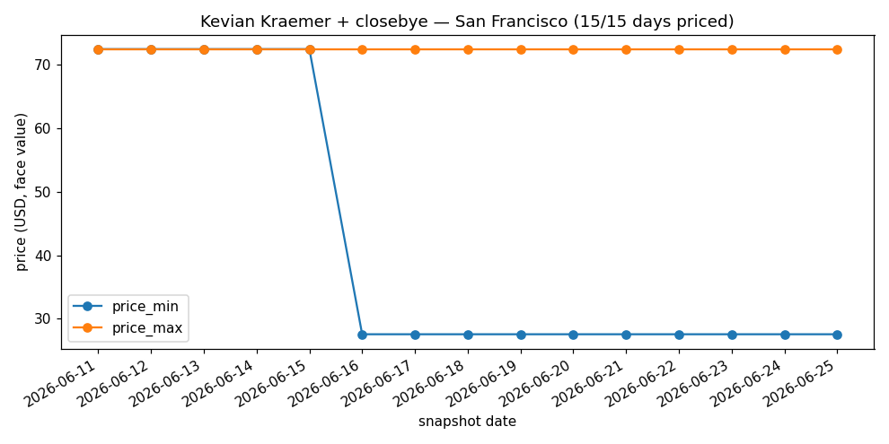

**Nic Vans + KnickerBocker Party — Atlantic City (15/15 days priced)**

**Caleb Gordon: The Eden Experience - Fort Lauderdale, FL — Fort Lauderdale (15/15 days priced)**

**Bone Thugs-N-Harmony — Rancho Cucamonga (15/15 days priced)**

**The Bends w/ special guest Margot Sinclair — San Luis Obispo (15/15 days priced)**

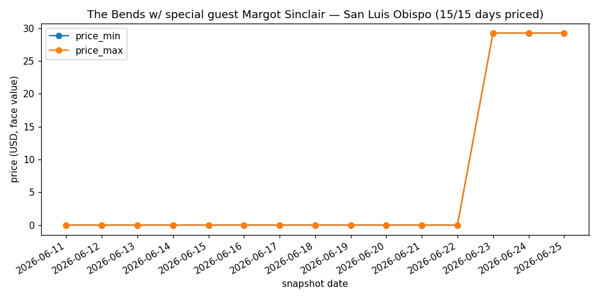

**Skáld with special guests — San Diego (15/15 days priced)**

## Highest-priced shows — San Francisco Bay Area

**Revocation, Defeated Sanity, Fuming Mouth, Weeping — San Jose ($521 max face; 15/15 days priced)**

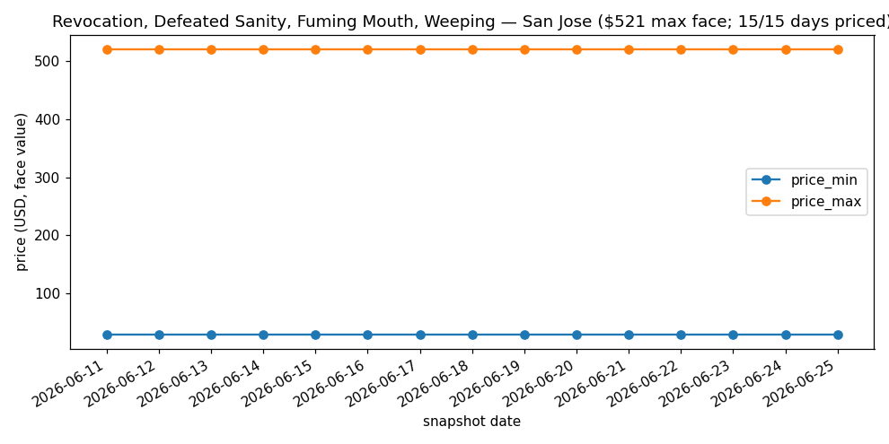

**Turnover, Narrow Head, She's Green — San Jose ($521 max face; 15/15 days priced)**

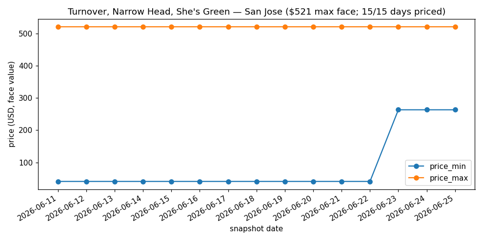

**DevilDriver, Upon a Burning Body, Ov Sulfur — San Jose ($521 max face; 15/15 days priced)**

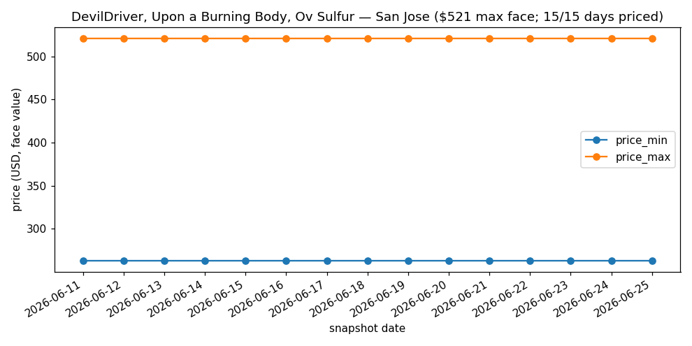

**Hail The Sun, A Lot Like Birds, Blight Town, Murals — San Jose ($521 max face; 2/2 days priced)**

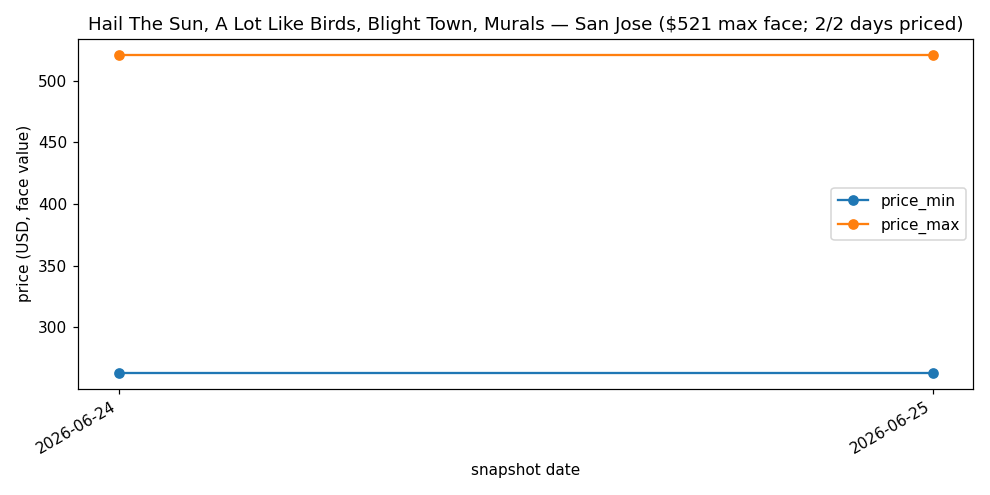

**House Party — San Jose ($521 max face; 7/7 days priced)**

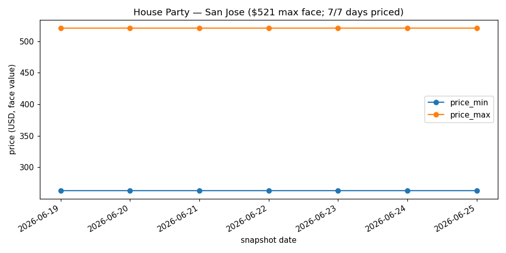

## Highest-priced shows — Nationwide (US)

**MISSION BAYFEST 2026 - 3DAY — San Diego ($3,560 max face; 15/15 days priced)**

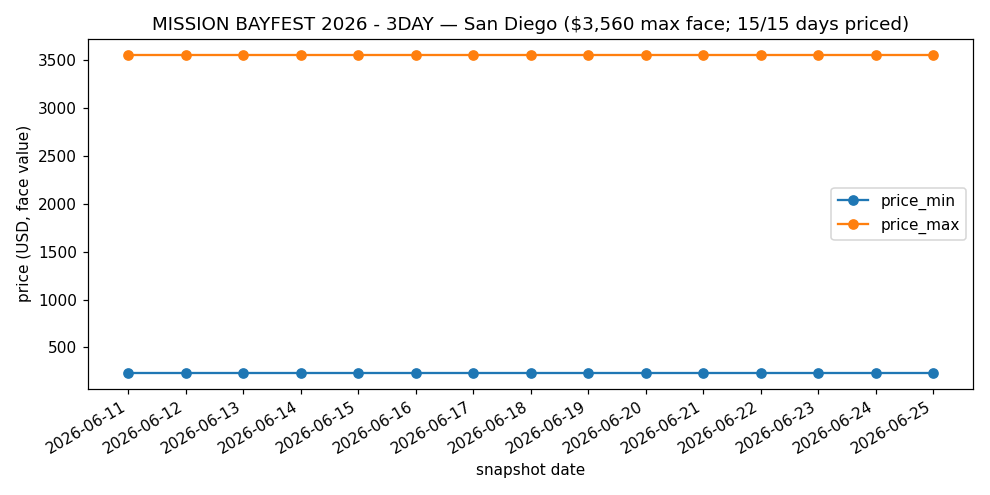

**MISSION BAYFEST 2026 - Saturday — San Diego ($3,300 max face; 15/15 days priced)**

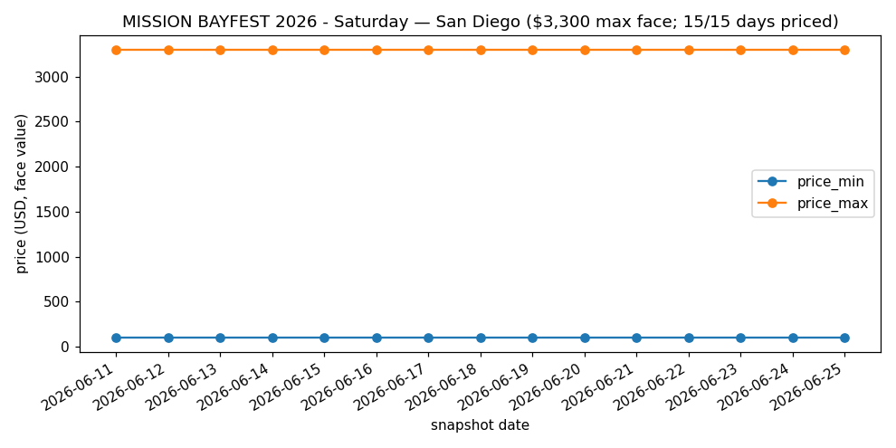

**MISSION BAYFEST 2026 - Sunday — San Diego ($3,300 max face; 15/15 days priced)**

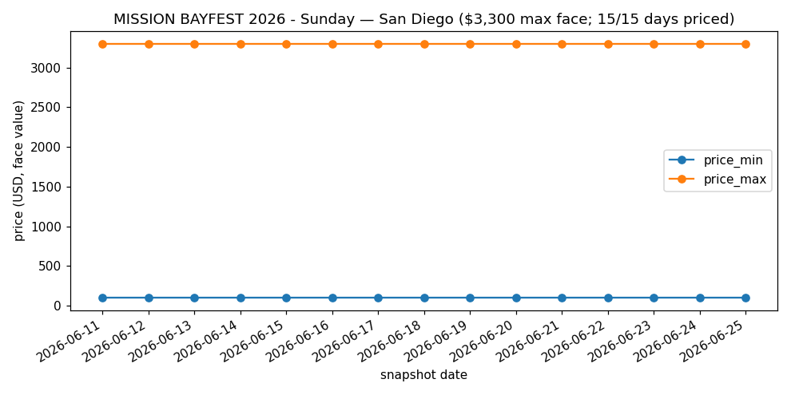

**MISSION BAYFEST 2026 - Friday — San Diego ($3,300 max face; 15/15 days priced)**

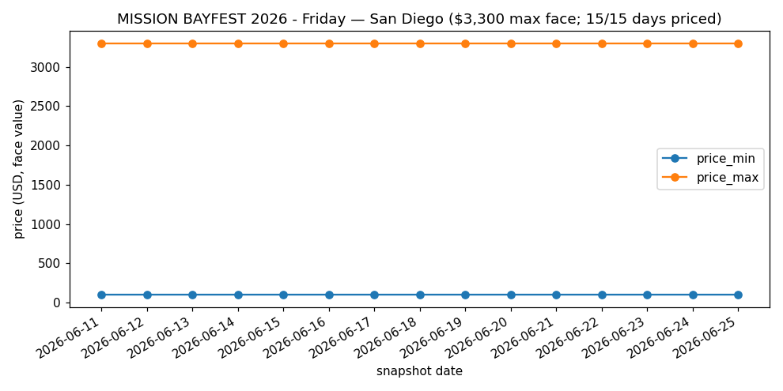

**Ivy Queen — Joliet ($1,417 max face; 15/15 days priced)**

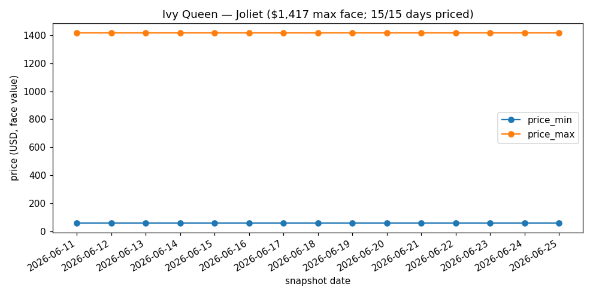

