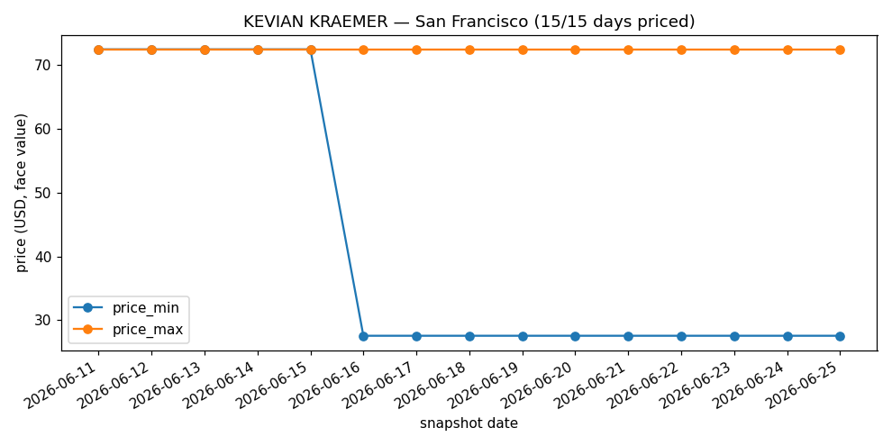
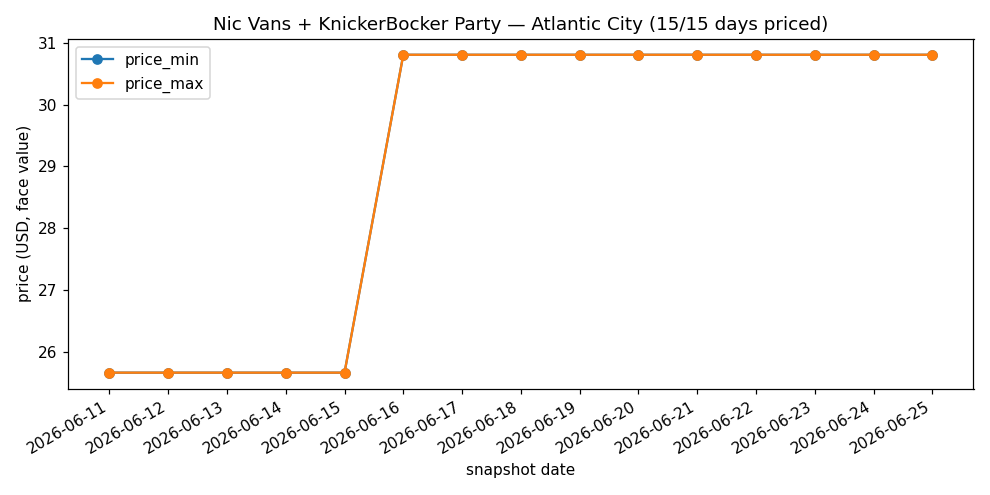
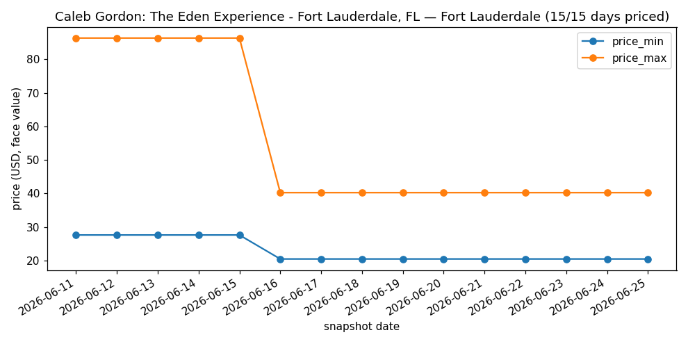
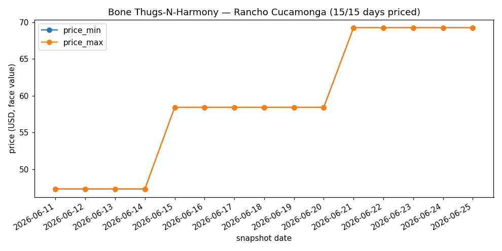
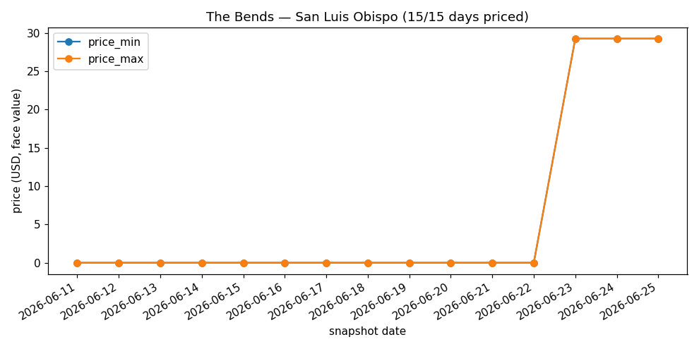
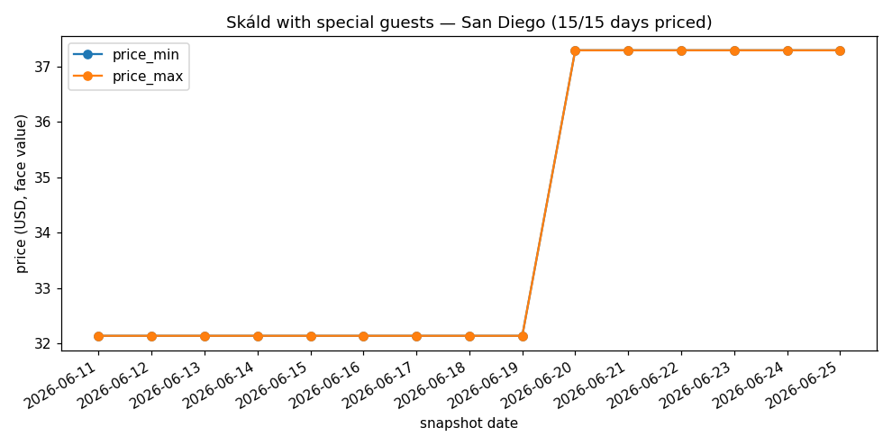

# Ticketmaster historical price coverage

_Generated by `eda/tm_price_eda.py`, as of 2026-06-25T22:39:13+00:00, over 15 daily snapshots (2026-06-11 … 2026-06-25). Re-run to refresh; numbers move only as snapshots accumulate._

## Headline — is price history the bottleneck?

- **40,593** distinct events seen across the **15** daily snapshots.
- **9,617** (23.7%) carry a price on at least one day; the rest are priceless rows (worthless for a price model).
- **8,049** are priced on **every** snapshot day they appear.
- **8,172** (20.1%) are **complete** (present ≥90% of the window AND priced ≥90% of present days) — the demo/model-ready set.
- Bay Area (DMA 807): 293 complete of 1,318. Dance/Electronic: 408 complete of 944.

## Priced-day distribution

| days_with_price | n_events |
|---|---|
| 0 | 30,976 |
| 1-4 | 589 |
| 5-9 | 403 |
| 10-14 | 576 |
| 15 (all) | 8,049 |

## price_type (Ticketmaster = face value, not resale)

| price_types | n_events |
|---|---|
| standard | 9,617 |

## Most complete coverage by genre

| genre | n_events | n_complete | pct_complete | median_priced_days |
|---|---|---|---|---|
| Rock | 11,530 | 1,686 | 14.6% | 0.0 |
| Alternative | 2,237 | 1,099 | 49.1% | 11.0 |
| Jazz | 1,556 | 918 | 59.0% | 15.0 |
| Other | 4,679 | 672 | 14.4% | 0.0 |
| Country | 3,662 | 638 | 17.4% | 0.0 |
| Fairs & Festivals | 541 | 439 | 81.1% | 15.0 |
| Pop | 4,245 | 411 | 9.7% | 0.0 |
| Dance/Electronic | 944 | 408 | 43.2% | 3.0 |
| Folk | 867 | 325 | 37.5% | 0.0 |
| Hip-Hop/Rap | 2,117 | 313 | 14.8% | 0.0 |
| Metal | 1,245 | 288 | 23.1% | 0.0 |
| R&B | 1,612 | 254 | 15.8% | 0.0 |
| World | 621 | 232 | 37.4% | 0.0 |
| Blues | 707 | 230 | 32.5% | 0.0 |
| Religious | 258 | 138 | 53.5% | 15.0 |

## Most complete coverage by metro (DMA)

| metro | n_events | n_complete | pct_complete | median_priced_days |
|---|---|---|---|---|
| New York NY | 3,754 | 1,385 | 36.9% | 0.0 |
| Los Angeles CA | 2,604 | 700 | 26.9% | 0.0 |
| Chicago IL | 1,837 | 660 | 35.9% | 0.0 |
| Nashville TN | 1,220 | 486 | 39.8% | 0.0 |
| Seattle-Tacoma WA | 988 | 341 | 34.5% | 0.0 |
| Detroit MI | 831 | 330 | 39.7% | 0.0 |
| San Francisco-Oakland-San Jose CA | 1,318 | 293 | 22.2% | 0.0 |
| Denver CO | 1,333 | 285 | 21.4% | 0.0 |
| San Diego CA | 870 | 260 | 29.9% | 0.0 |
| Cleveland-Akron (Canton) OH | 676 | 225 | 33.3% | 0.0 |
| Portland OR | 548 | 222 | 40.5% | 1.5 |
| Boston MA-Manchester NH | 1,662 | 182 | 11.0% | 0.0 |
| Phoenix AZ | 893 | 168 | 18.8% | 0.0 |
| Syracuse NY | 266 | 166 | 62.4% | 15.0 |
| Orlando-Daytona Beach-Melbourne FL | 401 | 158 | 39.4% | 3.0 |

## Sample price trajectories

**KEVIAN KRAEMER — San Francisco (15/15 days priced)**

**Nic Vans + KnickerBocker Party — Atlantic City (15/15 days priced)**

**Caleb Gordon: The Eden Experience - Fort Lauderdale, FL — Fort Lauderdale (15/15 days priced)**

**Bone Thugs-N-Harmony — Rancho Cucamonga (15/15 days priced)**

**The Bends — San Luis Obispo (15/15 days priced)**

**Skáld with special guests — San Diego (15/15 days priced)**

